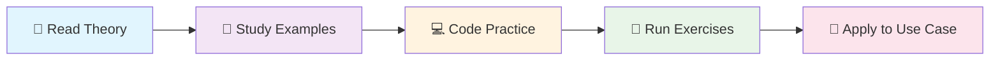

<div align="center">

# Claude Code Prompting 101

**The definitive guide to mastering prompt engineering with Claude**

<br>

[](https://www.python.org/downloads/)
[](https://docs.anthropic.com/)
[](https://github.com/StamKavid/claude-code-prompting-101)
[](https://github.com/StamKavid/claude-code-prompting-101)

**[🚀 Quick Start](#-quick-start)** • **[📚 Course Structure](#-course-structure)**

</div>

<br>
<br>

## 🚀 Quick Start

<table>
<tr>
<td width="50%">

### 📋 Prerequisites
- **Python 3.13** for code examples
- **Claude API access** (optional for practice)
- **Basic understanding of AI** concepts

</td>
<td width="50%">

### ⚡ Start Learning Now
```bash
git clone https://github.com/StamKavid/claude-code-prompting-101.git
cd claude-code-prompting-101
python -m pip install -r requirements.txt
```
**Ready!** Start with [Chapter 1](./chapters/01-introduction/) and follow the structured learning path.

</td>
</tr>
</table>

<br>


### 🎨 What Makes This Course Special?

<table>
<tr>
<td align="center" width="33%">

**📖 Comprehensive Theory**

8 structured chapters  
Real-world use cases  
Visual learning with diagrams

</td>
<td align="center" width="33%">

**💻 Hands-On Practice**

Interactive code examples  
Progressive exercises  
Production-ready templates

</td>
<td align="center" width="34%">

**🎯 Practical Focus**

Swedish insurance case study  
End-to-end implementation  
Industry best practices

</td>
</tr>
</table>

</div>

<br>

## 🤖 How This Repository Was Created

<div align="center">

*This educational repository demonstrates the power of AI-assisted content creation*

</div>

**Creation Process:**
- **🤖 AI Agent**: Claude Sonnet 4 Agent  
- **📺 Source Material**: [Anthropic's Claude Code Prompting 101 Tutorial](https://www.youtube.com/watch?v=ysPbXH0LpIE)
- **⚡ Generation Method**: Advanced prompt engineering with systematic content analysis
- **🎯 Output**: Complete course structure, code examples, Mermaid diagrams, and practical templates

**Original Prompt:**
> *"You are an expert in creating educational materials for AI. Your task is to go through the transcript of a tutorial from Anthropic on Claude Code Prompting 101, and structure a GitHub repo with sections and with theory + coding (if possible). Also try to generate mermaid charts for each chapter so that users can better understand the content."*

<br>

## 📚 Course Structure

<div align="center">

### 🎓 **Complete Learning Journey - 8 Comprehensive Chapters**

*Master prompt engineering through structured theory, practical examples, and visual learning*

</div>

<br>

<details open>
<summary><strong>🎯 Foundation Chapters (1-4)</strong></summary>

```
Chapter 1: Introduction to Prompt Engineering    🏁
├── What is prompt engineering?
├── Core principles and iterative development
├── Swedish insurance use case introduction
└── Common pitfalls and solutions

Chapter 2: Prompt Structure Fundamentals        🏗️
├── 10-point prompt structure framework
├── System vs User prompt organization
├── XML tags and structured formatting
└── API vs conversational approaches

Chapter 3: Task and Tone Context               🎭
├── Clear task descriptions and objectives
├── Tone setting and behavior guidance
├── Building confidence in AI responses
└── Factual accuracy requirements

Chapter 4: Background Data and Context         📊
├── Domain-specific information provision
├── Effective use of XML structure tags
├── System prompt optimization strategies
└── Context window management
```

</details>

<details>
<summary><strong>🚀 Advanced Chapters (5-8)</strong></summary>

```
Chapter 5: Examples and Few-Shot Learning      🎯
├── The power of examples in AI steering
├── Creating effective few-shot prompts
├── Visual examples with base64 encoding
└── Example selection and curation

Chapter 6: Detailed Instructions and Order     📋
├── Step-by-step reasoning guidance
├── Processing order importance
├── Preventing AI hallucinations
└── Logical flow construction

Chapter 7: Output Formatting and Guidelines    📄
├── Structured output with XML tags
├── Application-ready response formatting
├── Pre-filled responses and JSON output
└── Parsing and validation strategies

Chapter 8: Advanced Techniques                 ⚡
├── Extended thinking and reasoning
├── Prompt caching strategies
├── Real-world implementation patterns
└── Production deployment considerations
```

</details>

### 🔄 **Learning Workflow**



<br>


<details>
<summary><strong>Quick Reference</strong></summary>

**Key Resources:**
- 📋 [Production Guides](./resources/guides/)
- 🛠️ [Tool Templates](./resources/tools/)
- 📊 [Assessment Engine](./assessments/)
- 🎯 [Advanced Examples](./code-examples/advanced-techniques/)

</details>

</td>
</tr>
</table>

## 📖 What You'll Learn

### 🌟 **Master These Core Concepts**

<table>
<tr>
<td align="center" width="25%">

**🏗️ Prompt Architecture**

Structured frameworks  
XML organization  
System vs User prompts

</td>
<td align="center" width="25%">

**🎯 Context Engineering**

Domain expertise  
Background data  
Effective examples

</td>
<td align="center" width="25%">

**📊 Output Control**

Formatted responses  
JSON structures  
Application integration

</td>
<td align="center" width="25%">

**⚡ Production Optimization**

Caching strategies  
Performance tuning  
Error handling

</td>
</tr>
</table>

</div>

<br>

## 🛠️ Repository Structure

<div align="center">

### 📁 **Complete Learning Environment**

*Everything you need for mastering prompt engineering*

</div>

<br>

<details open>
<summary><strong>📚 Core Learning Materials</strong></summary>

```
chapters/                           # 🎓 8 comprehensive learning modules
├── 01-introduction/               #    Foundation concepts
├── 02-prompt-structure/           #    Architecture principles  
├── 03-task-and-tone/             #    Context and behavior
├── 04-background-context/         #    Domain expertise
├── 05-examples-and-few-shot/      #    Learning from examples
├── 06-detailed-instructions/      #    Step-by-step guidance
├── 07-output-formatting/          #    Structured responses
└── 08-advanced-techniques/        #    Production optimization

code-examples/                      # 💻 Hands-on implementations
├── basic-prompts/                 #    Getting started examples
├── advanced-techniques/           #    Production-ready code
├── systematic-analysis/           #    Analysis frameworks
└── output-formatting/             #    Response structuring
```

</details>

<details>
<summary><strong>🎯 Practical Resources</strong></summary>

```
resources/                          # 🛠️ Production templates & guides
├── guides/                        #    Best practice documentation
│   ├── advanced-prompting.md      #    Expert techniques
│   └── production-systems.md      #    Deployment strategies
├── templates/                     #    Ready-to-use examples
│   ├── insurance-claims.md        #    Swedish insurance system
│   ├── legal-review.md           #    Legal document analysis
│   └── medical-analysis.md        #    Healthcare applications
└── tools/                         #    Development utilities
    ├── prompt-builder.py          #    Interactive prompt creator
    ├── response-analyzer.py       #    Output quality assessment
    └── xml-validator.py           #    Structure validation

exercises/                          # ✏️ Interactive practice
├── chapter-01/                    #    Hands-on exercises
├── chapter-02/                    #    Structure fundamentals practice
└── [chapters 3-8]/               #    Additional exercises (planned)

assessments/                        # 📊 Progress tracking
├── assessment_engine.py           #    Automated evaluation
└── rubrics.md                     #    Grading criteria
```
<details>
<summary><strong>Progress Tracking</strong></summary>

- ✅ **Chapter completion** tracking
- 📊 **Skill assessment** rubrics  
- 🎯 **Exercise validation** engine
- 📈 **Learning analytics** dashboard

</details>

</td>
</tr>
</table>

<br>

## 🤝 Contributing & Community

<div align="center">

### 🌟 **Join the Claude Prompting Community**

*Help us build the best prompt engineering educational resource*

</div>

<br>

<table>
<tr>
<td width="50%">

### 🚀 **For Contributors**

**Quick Setup:**
```bash
git clone https://github.com/StamKavid/claude-code-prompting-101.git
cd claude-code-prompting-101
python -m pip install -r requirements.txt
python -m pytest tests/
```

**Contribution Areas:**
- 📚 **Educational Content** - New chapters, examples
- 💻 **Code Examples** - Production implementations  
- 🎨 **Visual Diagrams** - Mermaid chart improvements
- 🧪 **Exercise Creation** - Interactive learning materials
- 🔧 **Tool Development** - Utility scripts and validators

</td>
<td width="50%">

### 📖 **Learning Resources**

<details>
<summary><strong>Getting Help</strong></summary>

**Community Support:**
- 💬 **Discussions** - Ask questions, share insights
- 🐛 **Issues** - Report bugs, request features
- 📧 **Contact** - Direct support for educators

**Self-Help:**
- 📋 **FAQ** - Common questions answered
- 🎥 **Video Tutorials** - Visual learning supplements  
- 📊 **Progress Tracking** - Built-in assessment tools

</details>

<details>
<summary><strong>Advanced Learning</strong></summary>

**Beyond This Course:**
```bash
# Explore advanced examples
cd code-examples/advanced-techniques/
# Try production templates  
cd resources/templates/
# Build custom tools
cd resources/tools/
```


<br>

---

<div align="center">

## 📄 **License & Attribution**

**Educational Use License** - Free for learning and teaching

<br>

### 🙏 **Acknowledgments**

Based on **[Anthropic's Claude Code Prompting 101 Tutorial](https://www.youtube.com/watch?v=ysPbXH0LpIE)**  
Enhanced with AI-assisted educational content generation

<br>

### 🔗 **Connect & Learn**

[](https://github.com/StamKavid/claude-code-prompting-101)
[](./chapters/01-introduction/)
[](./code-examples/)
[](./assessments/)

<br>

### 🎯 **Ready to Transform Your AI Interactions?**

<br>

*From basic prompts to production systems. Master the art and science of prompt engineering.*

</div>
