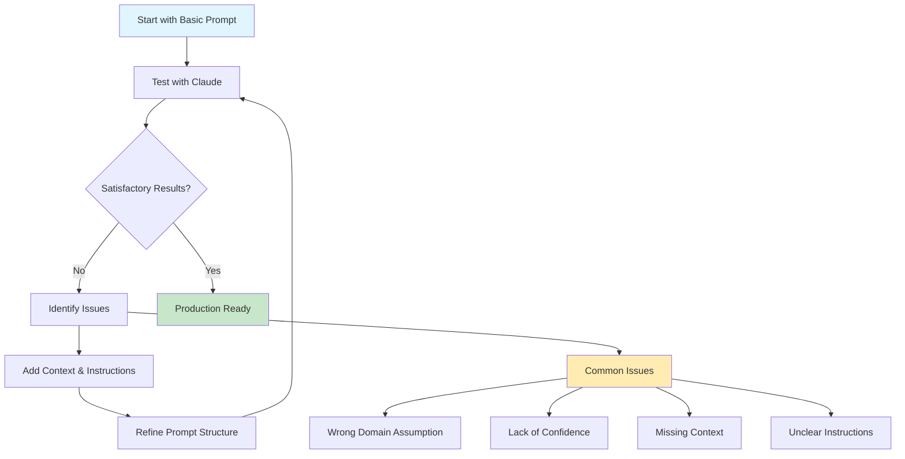

# Chapter 1: Introduction to Prompt Engineering 🎯

## Learning Objectives
By the end of this chapter, you will understand:
- What prompt engineering is and why it matters
- The iterative nature of prompt development
- Core principles for communicating effectively with Claude
- How to set up a structured approach to prompt engineering

## 📚 Theory

### What is Prompt Engineering?

Prompt engineering is the practice of writing clear instructions for language models to get them to do what we want. It involves:

- **Writing clear instructions** for the model
- **Providing necessary context** for task completion
- **Thinking through information arrangement** for optimal results

As Hannah from Anthropic's Applied AI team explains: *"This is the way that we communicate with a language model and try to get it to do what we want."*

### The Iterative Nature

Prompt engineering is fundamentally an **iterative, empirical science**. You don't get perfect results on the first try. Instead, you:

1. Start with a basic prompt
2. Test and observe results
3. Identify problems or gaps
4. Refine and improve
5. Repeat until satisfied

### Real-World Use Case: Swedish Car Insurance

Throughout this tutorial, we'll work with a practical example:
- **Scenario**: Working for a Swedish insurance company
- **Task**: Analyze car accident reports and determine fault
- **Data**: Swedish accident report forms + hand-drawn sketches
- **Goal**: Automated, confident fault determination

## 💻 Code Examples

### Version 1: Basic Prompt (The Problem)

```python
# Initial naive approach
basic_prompt = """
Review this accident report form and determine what happened in an accident and who's at fault.
"""

# Result: Claude thinks it's a skiing accident! 🎿
# Problem: Lack of context and specificity
```

**Issues with this approach:**
- No context about the domain (car vs. skiing accidents)
- No guidance on how to approach the analysis
- Vague instructions leading to incorrect assumptions

### Setting Up the Console (Best Practices)

```python
# Recommended Claude configuration
claude_config = {
    "model": "claude-4-sonnet",  # or claude-3.5 haiku
    "temperature": 0,           # For consistent, factual outputs
    "max_tokens": 4000,        # Generous token budget
    "system_prompt": "",       # We'll build this iteratively
}

# Why these settings?
# - Temperature 0: Ensures consistent, factual responses
# - High max_tokens: Prevents truncation of detailed analysis
# - System prompt: Where we'll put our structured instructions
```

## 📊 Mermaid Diagram: Prompt Engineering Process



## 🎯 Key Principles

### 1. **Start Simple, Build Complexity**
Begin with a basic prompt and systematically add improvements.

### 2. **Domain Context is Critical**
Always specify the domain and context clearly to prevent misunderstandings.

### 3. **Confidence Over Speculation**
Instruct Claude to only provide answers when confident, avoiding hallucinations.

### 4. **Empirical Approach**
Test, measure, iterate - treat it as a science, not art.

## 🔍 The Problem Demonstration

**What went wrong in Version 1?**

| Issue | Description | Impact |
|-------|-------------|---------|
| Domain Confusion | Claude assumed "skiing accident" | Completely wrong analysis |
| Lack of Specificity | No mention of cars or vehicles | Misinterpretation of forms |
| Missing Context | No background about Swedish forms | Inefficient processing |
| Vague Instructions | "Determine what happened" too broad | Unfocused output |

## 🛠️ Exercises

### Exercise 1: Identify the Problems
Given this basic prompt, list 5 specific improvements you would make:
```
"Look at this image and tell me what happened."
```

### Exercise 2: Domain Context
Rewrite the basic prompt to include proper domain context for a car insurance claim analysis.

### Exercise 3: Confidence Instructions
Add instructions that ensure Claude only responds when confident about its analysis.

## 📈 Next Steps

In [Chapter 2: Prompt Structure Fundamentals](../02-prompt-structure/), we'll learn:
- The 10-point prompt structure framework
- How to organize information for Claude
- Essential components of effective prompts
- Moving from basic to structured approaches

## 🔑 Key Takeaways

1. **Prompt engineering is iterative** - expect multiple refinements
2. **Context is king** - always provide clear domain information  
3. **Start with the problem** - understand what went wrong before fixing
4. **Confidence matters** - instruct Claude to avoid speculation
5. **Structure enables success** - organized prompts get better results

---

*"The best way to learn this is just to practice doing it."* - Hannah, Anthropic Applied AI Team
