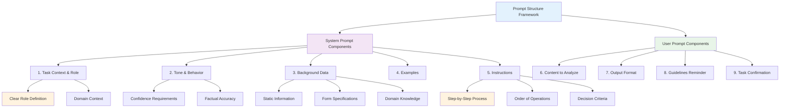

# Chapter 2: Prompt Structure Fundamentals 🏗️

## Learning Objectives
By the end of this chapter, you will understand:
- The 10-point prompt structure framework
- How to organize information effectively for Claude
- The difference between conversational and API-style prompts
- Best practices for structuring prompts

## 📚 Theory

### The Structured Approach vs. Conversational

Most people are familiar with **conversational interactions** - going back and forth with Claude in a chat-like manner. However, for production applications, we need **structured, single-shot prompts** that get the task right the first time.

### The 10-Point Prompt Structure Framework

According to Anthropic's best practices, an effective prompt should include these components:

#### 1. **Task Description** 🎯
- **What**: Claude's role and primary objective
- **Why**: The purpose and context of the task
- **When**: Any timing or urgency considerations

#### 2. **Content** 📄
- Dynamic data that changes between requests
- Images, documents, forms, or text to analyze
- The "raw material" Claude works with

#### 3. **Detailed Instructions** 📋
- Step-by-step guidance for analysis
- Specific methodology to follow
- Order of operations (very important!)

#### 4. **Examples** 💡
- Few-shot learning samples
- Visual examples when relevant
- Expected input/output patterns

#### 5. **Reminder/Guidelines** ⚠️
- Critical information reinforcement
- Important constraints or limitations
- Quality and accuracy requirements

### Recommended Structure Layout

```
1. Task Context & Role
2. Tone & Behavior Guidelines  
3. Background Data & Documents
4. Examples (Few-shot)
5. Conversation History (if applicable)
6. Detailed Step-by-Step Instructions
7. Content to Analyze
8. Output Formatting Requirements
9. Important Guidelines Reminder
10. Final Task Confirmation
```

## 💻 Code Examples

### API-Style Prompt Template

```python
def build_structured_prompt(
    task_context: str,
    background_info: str,
    instructions: list,
    content: str,
    output_format: str,
    guidelines: list
) -> dict:
    """
    Build a structured prompt following the 10-point framework
    """
    
    system_prompt = f"""
    {task_context}
    
    <background_information>
    {background_info}
    </background_information>
    
    <instructions>
    {format_instructions(instructions)}
    </instructions>
    
    <output_format>
    {output_format}
    </output_format>
    
    <important_guidelines>
    {format_guidelines(guidelines)}
    </important_guidelines>
    """
    
    user_prompt = f"""
    Please analyze the following content according to the instructions above:
    
    <content>
    {content}
    </content>
    
    Begin your analysis now.
    """
    
    return {
        "system": system_prompt,
        "user": user_prompt
    }

def format_instructions(instructions: list) -> str:
    return "\n".join([f"{i+1}. {instruction}" for i, instruction in enumerate(instructions)])

def format_guidelines(guidelines: list) -> str:
    return "\n".join([f"- {guideline}" for guideline in guidelines])
```

### Example: Car Insurance Claim Analysis Structure

```python
# Task Context
task_context = """
You are an AI assistant helping a claims adjuster at a Swedish car insurance company. 
Your role is to analyze car accident report forms and hand-drawn sketches to determine 
what happened in vehicular accidents and assess fault.
"""

# Background Information  
background_info = """
You will be analyzing Swedish car accident report forms that contain:
- 17 standardized checkboxes (numbered 1-17)
- Two columns representing Vehicle A and Vehicle B
- Human-filled markings (X, circles, scribbles, or checks)
- Accompanying hand-drawn accident sketches

The forms are in Swedish and follow a standardized format used across the country.
"""

# Detailed Instructions
instructions = [
    "First, carefully examine the accident report form",
    "Identify which checkboxes are marked for Vehicle A and Vehicle B",
    "Note any unclear or ambiguous markings",
    "Then analyze the hand-drawn sketch",
    "Correlate the sketch information with the form data",
    "Only make fault determinations when highly confident",
    "Provide specific evidence for your conclusions"
]

# Output Format
output_format = """
<form_analysis>
[Your analysis of the checkboxes and markings]
</form_analysis>

<sketch_analysis>
[Your interpretation of the hand-drawn sketch]
</sketch_analysis>

<final_verdict>
[Your fault determination with confidence level]
</final_verdict>
"""

# Important Guidelines
guidelines = [
    "Only provide assessments when highly confident",
    "Reference specific form elements in your reasoning",
    "If markings are unclear, state this explicitly",
    "Maintain factual accuracy over speculation"
]
```

## 📊 Mermaid Diagram: Prompt Structure Framework



## 🎯 Key Principles

### 1. **Separation of Concerns**
- **System Prompt**: Static information, context, instructions
- **User Prompt**: Dynamic content, specific requests

### 2. **Logical Flow**
- Context before content
- Instructions before execution
- Guidelines as reinforcement

### 3. **Clear Delimiters**
Use XML tags or markdown to separate different sections:
```xml
<task_description>
</task_description>

<background_information>
</background_information>

<instructions>
</instructions>
```

### 4. **Progressive Specification**
Start broad (context) and get specific (instructions and format).

## 🔍 Structure Benefits

| Component | Purpose | Benefit |
|-----------|---------|---------|
| Task Context | Sets role and domain | Prevents misunderstanding |
| Background Info | Provides static knowledge | Reduces processing time |
| Instructions | Guides methodology | Ensures consistent approach |
| Examples | Shows expected patterns | Improves accuracy |
| Output Format | Structures responses | Enables automation |
| Guidelines | Reinforces key points | Prevents errors |

## 🛠️ Exercises

### Exercise 1: Component Identification
Given this poorly structured prompt, identify which of the 10 components are missing:
```
"Look at this form and tell me who crashed into whom."
```

### Exercise 2: Structure Reorganization
Take the following jumbled prompt elements and organize them according to the 10-point framework:
- "Make sure you're confident"
- "You're a claims adjuster" 
- "The form has 17 checkboxes"
- "Analyze this accident report"
- "Output in XML format"

### Exercise 3: Build Your Own Structure
Create a structured prompt for a different domain (e.g., medical diagnosis, legal document review, or technical troubleshooting).

## 📈 Performance Comparison

### Before: Unstructured Approach
```
❌ Unclear role definition
❌ Mixed instructions with content  
❌ No output format specification
❌ Inconsistent results
❌ Difficult to automate
```

### After: Structured Approach
```
✅ Clear separation of components
✅ Logical information flow
✅ Consistent output format
✅ Predictable behavior
✅ Production-ready
```

## 📋 Checklist: Well-Structured Prompt

- [ ] **Task context** clearly defines Claude's role
- [ ] **Background information** provides necessary domain knowledge
- [ ] **Instructions** are step-by-step and specific
- [ ] **Content** is clearly separated from instructions
- [ ] **Output format** is explicitly specified
- [ ] **Guidelines** reinforce critical requirements
- [ ] **XML tags** or clear delimiters separate sections
- [ ] **Logical flow** from context to execution

## 📈 Next Steps

In [Chapter 3: Task and Tone Context](../03-task-and-tone/), we'll dive deep into:
- Setting clear task descriptions that prevent misunderstandings
- Defining appropriate tone and behavior for confidence
- Building the foundation for factual, reliable outputs
- Version 2 improvements to our car insurance example

## 🔑 Key Takeaways

1. **Structure enables success** - organized prompts get better results
2. **Separate system from user concerns** - static vs. dynamic information
3. **Use clear delimiters** - XML tags help Claude understand organization
4. **Follow logical flow** - context → instructions → content → format
5. **Progressive specification** - broad to specific information arrangement

---

*"Claude really loves structure, loves organization. That's why we recommend following kind of a standard structure in your prompts."* - Hannah, Anthropic Applied AI Team
