# Chapter 3: Task and Tone Context

## Learning Objectives
By the end of this chapter, you will understand:
- How to set clear, unambiguous task descriptions
- The importance of tone in shaping Claude's behavior
- Building confidence and preventing hallucinations
- Version 2 improvements to our car insurance example

## Theory

### The Critical Foundation: Task Context

**Task context is the foundation** that prevents Claude from making fundamental misunderstandings about what you want. As we saw in Chapter 1, without proper task context, Claude assumed our car accident analysis was about a skiing accident!

#### What Makes Good Task Context?

1. **Explicit Role Definition**: Who is Claude pretending to be?
2. **Domain Specification**: What field/industry are we working in?
3. **Specific Objectives**: What exactly needs to be accomplished?
4. **Scope Boundaries**: What should and shouldn't be included?

### Tone Context: Shaping Behavior

Tone context defines **how** Claude should approach the task:

- **Confidence Level**: How certain should Claude be before providing answers?
- **Communication Style**: Professional, technical, explanatory, concise?
- **Error Handling**: What to do when uncertain or when data is unclear?
- **Factual Accuracy**: Prioritize facts over speculation

#### Key Tone Principles for Our Use Case

1. **Stay Factual**: Only provide information that can be verified from the data
2. **Stay Confident**: Only make assessments when highly certain
3. **Be Explicit About Uncertainty**: If something is unclear, say so
4. **Reference Evidence**: Always tie conclusions back to specific data points

## Code Examples

### Version 2: Adding Task and Tone Context

```python
# Version 2 System Prompt - Improved with Task & Tone Context
system_prompt_v2 = """
You are an AI assistant helping a human claims adjuster who is reviewing car accident report forms in Swedish. 

Your role is to:
1. Analyze Swedish car accident report forms containing standardized checkboxes
2. Interpret hand-drawn sketches of the incident  
3. Provide factual assessments based on the available evidence
4. Determine fault only when you have high confidence

Tone and Behavior Guidelines:
- Stay factual and confident in your assessments
- If you cannot understand what you're looking at, do not guess
- Only make fault determinations when you are highly confident
- If the data is unclear or ambiguous, explicitly state this
- Reference specific evidence from the forms when making claims

You should NOT make assessments if you are not fully confident in your analysis.
"""

user_prompt_v2 = """
Please analyze the attached Swedish car accident report form and sketch. 
The form contains checkboxes for Vehicle A and Vehicle B, and there is an accompanying hand-drawn sketch of the incident.

Provide your analysis and, if confident, determine which vehicle was at fault.
"""
```

### Comparison: Version 1 vs Version 2

```python
# Version 1 - Basic (Problematic)
v1_prompt = "Review this accident report form and determine what happened in an accident and who's at fault."

# Version 2 - With Task & Tone Context  
v2_improvements = {
    "role_clarity": "AI assistant helping a human claims adjuster",
    "domain_specification": "Swedish car accident report forms", 
    "task_specificity": "Analyze forms + sketches, determine fault",
    "confidence_requirements": "Only assess when highly confident",
    "uncertainty_handling": "Explicitly state when unclear",
    "evidence_requirements": "Reference specific form elements"
}

# Results Comparison:
# V1: "This appears to be a skiing accident on Chappangan street"  ❌
# V2: "This is a car accident between Vehicle A and Vehicle B"     ✅
```

### Building Confidence Constraints

```python
def add_confidence_constraints(base_prompt: str) -> str:
    """
    Add confidence and accuracy constraints to prevent hallucinations
    """
    confidence_guidelines = """
    
    CONFIDENCE REQUIREMENTS:
    - Only provide fault determinations when you are highly confident (>90% certainty)
    - If checkboxes are unclear, ambiguous, or difficult to read, state this explicitly
    - If the sketch is illegible or contradicts the form, note the discrepancy
    - When uncertain, it's better to say "insufficient evidence" than to guess
    - Always explain your reasoning with specific references to the evidence
    
    FACTUAL ACCURACY REQUIREMENTS:
    - Base all conclusions on observable evidence from the provided materials
    - Do not infer details that are not clearly visible
    - Distinguish between what you can see clearly vs. what might be unclear
    - If human handwriting is ambiguous, acknowledge this limitation
    """
    
    return base_prompt + confidence_guidelines

# Example of confidence-based output
confident_response = """
<confidence_level>High (95%)</confidence_level>
<reasoning>Vehicle B clearly has checkbox 12 marked (failure to yield), 
while Vehicle A shows no fault indicators. The sketch corroborates this 
with Vehicle B approaching from the right without stopping.</reasoning>
<verdict>Vehicle B at fault</verdict>
"""

uncertain_response = """
<confidence_level>Low (40%)</confidence_level>
<reasoning>The markings on checkboxes 3 and 7 are ambiguous - they appear 
to be light pencil marks that could be stray marks rather than intentional 
selections. The sketch is also unclear in this area.</reasoning>
<verdict>Insufficient evidence for fault determination</verdict>
"""
```

## Mermaid Diagram: Task and Tone Context Framework

```mermaid
flowchart TD
    A[Task & Tone Context] --> B[Task Context Components]
    A --> C[Tone Context Components]
    
    B --> D[Role Definition]
    B --> E[Domain Specification]  
    B --> F[Objective Clarification]
    B --> G[Scope Boundaries]
    
    C --> H[Confidence Requirements]
    C --> I[Communication Style]
    C --> J[Error Handling]
    C --> K[Factual Accuracy]
    
    D --> L["AI assistant helping claims adjuster"]
    E --> M["Swedish car insurance analysis"]
    F --> N["Analyze forms + determine fault"]
    G --> O["Vehicle accidents only, not skiing"]
    
    H --> P["Only assess when >90% confident"]
    I --> Q["Professional, evidence-based"]
    J --> R["Explicitly state uncertainty"]
    K --> S["Reference specific evidence"]
    
    B --> T[Prevents Domain Confusion]
    C --> U[Prevents Hallucinations]
    
    T --> V[Version 1: Skiing accident ❌]
    T --> W[Version 2: Car accident ✅]
    
    U --> X[Confident when evidence supports]
    U --> Y[Uncertain when evidence unclear]
    
    style A fill:#e1f5fe
    style B fill:#f3e5f5
    style C fill:#e8f5e8
    style T fill:#ffcdd2
    style U fill:#c8e6c9
```



## Task Context Best Practices

### 1. **Be Specific About the Role**
```python
# ❌ Vague
"You are helpful"

# ✅ Specific  
"You are an AI assistant helping a human claims adjuster at a Swedish car insurance company"
```

### 2. **Define the Domain Clearly**
```python
# ❌ Ambiguous
"Analyze this report"

# ✅ Domain-Specific
"Analyze Swedish car accident report forms containing 17 standardized checkboxes for Vehicle A and Vehicle B"
```

### 3. **Set Clear Objectives**
```python
# ❌ Unclear goals
"Tell me what happened"

# ✅ Clear objectives  
"1. Identify which checkboxes are marked for each vehicle
 2. Interpret the hand-drawn accident sketch
 3. Determine fault only when highly confident"
```

## Tone Context Best Practices

### 1. **Confidence Calibration**
```python
confidence_spectrum = {
    "overconfident": "Always provide a definitive answer",     # ❌ Dangerous
    "balanced": "Only answer when confident",                  # ✅ Good
    "underconfident": "Always express uncertainty"             # ❌ Unhelpful
}
```

### 2. **Uncertainty Communication**
```python
# ✅ Good uncertainty handling
uncertainty_phrases = [
    "The marking on checkbox 7 is ambiguous and could be either...",
    "Insufficient evidence to determine fault with confidence",
    "The sketch is unclear in this area, showing...",
    "Based on the clearly visible evidence..."
]
```

### 3. **Evidence-Based Communication**
```python
# ✅ Always reference evidence
evidence_based_language = [
    "Based on the clearly marked checkbox 12 for Vehicle B...",
    "The sketch shows Vehicle A approaching from the left...", 
    "Form section 3 indicates that Vehicle B was turning right...",
    "The hand-drawn diagram corroborates the checkbox data..."
]
```

## Version 2 Results Analysis

### What Changed?
| Aspect | Version 1 | Version 2 |
|--------|-----------|-----------|
| **Domain Recognition** | Skiing accident | Car accident ✅ |
| **Data Identification** | Generic "report" | Vehicle A/B checkboxes ✅ |
| **Confidence Level** | Assumed details | More cautious ✅ |
| **Evidence References** | None | Some improvement ✅ |
| **Fault Determination** | Not attempted | Still lacks confidence |

### Remaining Issues
Even with Version 2 improvements, Claude still says:
> *"There's some information missing for Claude to make a fully confident determination of who's at fault here."*

This is **actually good behavior** - Claude correctly identifies that it needs more context about the form structure itself.

## ️ Exercises

### Exercise 1: Role Definition Practice
Write three different role definitions for these scenarios:
1. Legal document review
2. Medical symptom analysis  
3. Software bug triage

### Exercise 2: Confidence Calibration
For each scenario, write appropriate confidence requirements:
1. Financial fraud detection (high stakes)
2. Content recommendation (low stakes)
3. Medical diagnosis (very high stakes)

### Exercise 3: Tone Comparison
Compare these two tone approaches for the same task:
```
Tone A: "Provide your best guess about what happened"
Tone B: "Only provide assessments when you have clear evidence and high confidence"
```
Which is better for insurance claims and why?

### Exercise 4: Error Handling
Write error handling instructions for when:
1. The image is blurry or unreadable
2. The form appears to be in a different language than expected
3. The data contradicts itself

## Impact Measurement

### Before vs. After Task & Tone Context

#### Before (Version 1):
```
❌ Domain: Skiing (wrong)
❌ Confidence: Assumed details
❌ Evidence: No references
❌ Uncertainty: Not acknowledged
```

#### After (Version 2):
```
✅ Domain: Car insurance (correct)
✅ Confidence: Appropriately cautious
✅ Evidence: Some referencing
✅ Uncertainty: Explicitly stated
```

### Key Performance Indicators
- **Domain Accuracy**: 0% → 100%
- **False Confidence**: High → Low  
- **Evidence Usage**: None → Some
- **Uncertainty Handling**: Poor → Good

## Next Steps

In [Chapter 4: Background Data and Context](../04-background-context/), we'll address the remaining issues by:
- Providing detailed form specifications to Claude
- Using XML tags for organization  
- Optimizing the system prompt with static information
- Moving from "some confidence" to "high confidence"

## Key Takeaways

1. **Task context prevents fundamental misunderstandings** - domain specification is critical
2. **Tone context shapes behavior** - confidence requirements prevent hallucinations  
3. **Explicit uncertainty handling** is better than false confidence
4. **Evidence-based reasoning** should be required and reinforced
5. **Iterative improvement works** - Version 2 shows clear progress over Version 1

---

*"Key thing here is we want Claude to stay factual and to stay confident. If Claude can't understand what it's looking at, we don't want to guess and just sort of mislead us."* - Christian, Anthropic Applied AI Team
