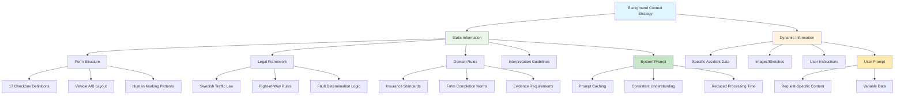

# Chapter 4: Background Data and Context

## Learning Objectives
By the end of this chapter, you will understand:
- How to provide static domain knowledge to Claude
- The power of XML tags for organizing information
- System prompt optimization strategies
- Version 3 breakthrough to confident fault determination

## Theory

### The Static vs. Dynamic Information Principle

One of the key insights from the Anthropic tutorial is distinguishing between:

- **Static Information**: Never changes between requests (form structure, domain rules)
- **Dynamic Information**: Changes with each request (the specific accident data)

**Static information belongs in the system prompt** - it's the perfect candidate for:
- Prompt caching (performance optimization)
- Reduced processing time (Claude doesn't need to figure out the form structure each time)
- Consistent interpretation (same understanding across all requests)

### Form Knowledge: The Missing Piece

In Version 2, Claude knew it was dealing with car accidents but still lacked confidence because it didn't understand:
- What each of the 17 checkboxes meant
- How the form was structured  
- What Vehicle A and Vehicle B represented
- How humans typically fill out these forms

**This domain knowledge is static** - the Swedish car accident form structure never changes between claims.

### XML Tags: Claude's Preferred Organization

Claude has been fine-tuned to understand and work well with XML-style tags:
```xml
<background_information>
Static knowledge that applies to all requests
</background_information>

<form_structure>
Detailed specifications about data formats
</form_structure>

<user_preferences>
How the user wants information presented
</user_preferences>
```

Benefits of XML tags:
- **Clear separation** of different types of information
- **Easy reference** - Claude can refer back to tagged sections
- **Structured thinking** - Helps Claude organize its analysis
- **Debugging friendly** - Easy to see what information was provided

## Code Examples

### Version 3: Adding Comprehensive Background Context

```python
# Version 3 System Prompt - Complete with Background Context
system_prompt_v3 = """
You are an AI assistant helping a human claims adjuster who is reviewing car accident report forms in Swedish.

<background_information>
You will be analyzing Swedish car accident report forms that follow a standardized national format. 
These forms are used across all insurance companies in Sweden for documenting vehicle accidents.
</background_information>

<form_structure>
The Swedish car accident form contains:
- Title: "TRAFIKFÖRSÄKRINGSFÖRENING" (Traffic Insurance Association)
- Two columns representing Vehicle A (left) and Vehicle B (right)
- 17 numbered rows with specific traffic scenarios
- Checkboxes that can be marked with X, checkmarks, circles, or scribbles

Checkbox Meanings:
1. Backed out of parking space/garage
2. Opened car door into traffic
3. Emerged from parking lot/private road
4. Made a U-turn
5. Started from parked position
6. Made a left turn
7. Made a right turn  
8. Changed lanes to the left
9. Changed lanes to the right
10. Overtook another vehicle
11. Drove straight ahead
12. Failed to yield right of way
13. Followed too closely (rear-ended)
14. Exceeded speed limit
15. Ignored traffic signal/sign
16. Drove under influence of alcohol/drugs
17. Other traffic violation

Additional Information:
- Each checkbox represents an action/violation that contributed to the accident
- Multiple checkboxes can be marked for each vehicle
- Vehicle A is typically the reporting party's vehicle
- Vehicle B is typically the other party's vehicle
</form_structure>

<human_form_completion_patterns>
Important notes about how humans fill out these forms:
- Markings may not be perfect X's - could be checkmarks, circles, scribbles, or light pencil marks
- Some marks might be unclear or ambiguous
- Humans sometimes mark boxes lightly or incompletely
- Look for any type of intentional marking, not just perfect X's
- If a marking is unclear, acknowledge this in your analysis
</human_form_completion_patterns>

<analysis_approach>
Your role is to:
1. Carefully examine each checkbox for both vehicles
2. Interpret any hand-drawn sketches provided
3. Correlate the form data with the sketch information
4. Determine fault based on clear evidence
5. Only make confident assessments when the evidence is clear

Confidence Guidelines:
- Make fault determinations only when you have high confidence (>90%)
- Reference specific checkbox numbers and evidence in your reasoning
- If markings are ambiguous, state this explicitly
- Provide detailed reasoning for your conclusions
</analysis_approach>
"""

user_prompt_v3 = """
Please analyze the attached Swedish car accident report form and sketch according to your background knowledge of the form structure.

Provide a detailed analysis following this format:

<form_analysis>
[Detailed examination of checkboxes for Vehicle A and Vehicle B]
</form_analysis>

<sketch_analysis>  
[Analysis of the hand-drawn accident sketch]
</sketch_analysis>

<correlation>
[How the form data and sketch information align or conflict]
</correlation>

<final_verdict>
[Your fault determination with confidence level and reasoning]
</final_verdict>
"""
```

### Organizing Background Information

```python
def create_domain_knowledge_sections():
    """
    Organize static domain knowledge into logical sections
    """
    
    sections = {
        "legal_framework": """
        <legal_framework>
        Swedish traffic law follows right-of-way principles:
        - Vehicles on the right have right of way at unmarked intersections
        - Turning vehicles must yield to straight-through traffic
        - Following too closely is always a violation
        - Failure to yield is a primary cause of fault determination
        </legal_framework>
        """,
        
        "form_specifications": """
        <form_specifications>
        Standard Swedish Accident Report Form (Skadeanmälan):
        - Used by all insurance companies since 1987
        - Bilateral agreement form filled by both parties
        - 17 standardized scenarios covering 95% of accident types
        - Legal document used in court proceedings
        - Available in Swedish, English, and other EU languages
        </form_specifications>
        """,
        
        "interpretation_guidelines": """
        <interpretation_guidelines>
        Checkbox Analysis Rules:
        - Any intentional mark counts as "checked" 
        - Light pencil marks may indicate uncertainty
        - Multiple checkboxes can apply to one vehicle
        - Checkbox 17 "Other" requires additional explanation
        - Unmarked checkboxes indicate the action did not occur
        
        Fault Determination Hierarchy:
        1. Traffic violations (checkboxes 12-17) usually indicate fault
        2. Action-based checkboxes (1-11) provide context
        3. Sketch provides spatial relationships and sequence
        4. Correlation between form and sketch confirms accuracy
        </interpretation_guidelines>
        """
    }
    
    return sections

# Example of prompt caching optimization
def build_cacheable_system_prompt():
    """
    Structure system prompt for optimal caching
    """
    # Static sections that never change - perfect for caching
    static_content = [
        create_domain_knowledge_sections()["legal_framework"],
        create_domain_knowledge_sections()["form_specifications"], 
        create_domain_knowledge_sections()["interpretation_guidelines"]
    ]
    
    # Dynamic sections that might change
    dynamic_content = [
        "task_specific_instructions",
        "output_format_requirements"
    ]
    
    return {
        "cacheable": "\n".join(static_content),
        "dynamic": dynamic_content
    }
```

## Mermaid Diagram: Background Context Architecture



## Background Context Best Practices

### 1. **Comprehensive Form Knowledge**
```python
# ✅ Complete checkbox definitions
checkbox_definitions = {
    1: "Backed out of parking space/garage",
    2: "Opened car door into traffic", 
    3: "Emerged from parking lot/private road",
    # ... all 17 definitions
    17: "Other traffic violation (requires explanation)"
}

# ❌ Incomplete knowledge
vague_description = "The form has checkboxes for different scenarios"
```

### 2. **Human Behavior Patterns**
```python
# ✅ Realistic expectations about form completion
human_patterns = """
- Markings may be checkmarks, X's, circles, or scribbles
- Some marks might be light or unclear
- People sometimes mark multiple boxes
- Handwriting quality varies significantly
"""

# ❌ Perfect world assumptions  
perfect_world = "Forms will have clear X marks in appropriate boxes"
```

### 3. **Legal/Domain Context**
```python
# ✅ Relevant legal principles
legal_context = """
Swedish Traffic Law Key Principles:
- Right-of-way violations are primary fault indicators
- Following distance requirements are strict
- Turning vehicles yield to straight traffic
"""

# ❌ Missing legal framework
no_context = "Determine who was at fault"
```

## Version 3 Breakthrough Results

### What Changed?
| Aspect | Version 2 | Version 3 |
|--------|-----------|-----------|
| **Form Understanding** | Generic "checkboxes" | Specific 17-point definitions ✅ |
| **Confidence Level** | Uncertain | High confidence ✅ |
| **Evidence References** | Vague | Specific checkbox numbers ✅ |
| **Fault Determination** | Avoided | Clear verdict: "Vehicle B at fault" ✅ |
| **Processing Speed** | Slow (figuring out form) | Fast (knows form structure) ✅ |

### Example Output Improvement
```python
# Version 2 (uncertain)
v2_output = """
I can see this is a car accident between Vehicle A and Vehicle B. 
Vehicle A was marked on checkbox 1 and Vehicle B was on 12.
However, there's some information missing for me to make a fully 
confident determination of who's at fault here.
"""

# Version 3 (confident)  
v3_output = """
<form_analysis>
Vehicle A: Checkbox 1 marked (backed out of parking space)
Vehicle B: Checkbox 12 clearly marked (failed to yield right of way)
</form_analysis>

<sketch_analysis>
The sketch shows Vehicle A backing out while Vehicle B approached 
from the right without yielding.
</sketch_analysis>

<final_verdict>
Vehicle B is at fault. Checkbox 12 (failure to yield right of way) 
is a clear traffic violation, while backing out of parking (checkbox 1) 
is a normal driving action. Confidence: 95%
</final_verdict>
"""
```

## ️ Exercises

### Exercise 1: Static vs. Dynamic Classification
Classify these information types as static (S) or dynamic (D):
- [ ] Form field definitions
- [ ] Specific accident images  
- [ ] Traffic law principles
- [ ] User's preferred output format
- [ ] Domain terminology
- [ ] Individual case details

### Exercise 2: XML Organization
Organize this jumbled information using appropriate XML tags:
- "The user wants JSON output"
- "Traffic violations indicate fault"  
- "Checkbox 7 means right turn"
- "This specific accident happened on Tuesday"
- "Forms may have unclear markings"

### Exercise 3: Domain Knowledge Expansion
For a medical diagnosis use case, list 5 types of static background information that should be in the system prompt.

### Exercise 4: Prompt Caching Strategy
Design a caching strategy for a legal document review system. What stays static? What changes?

## Performance Impact

### Processing Time Reduction
- **Version 2**: Claude spends time figuring out what each checkbox means
- **Version 3**: Claude immediately knows checkbox definitions, focuses on analysis

### Confidence Improvement  
- **Version 2**: "Some information missing" → uncertain output
- **Version 3**: "Based on checkbox 12 violation" → confident verdict

### Consistency Benefits
- **Multiple requests**: Same form understanding every time
- **Different analysts**: Consistent interpretation framework
- **Automated systems**: Predictable output structure

## Background Context Checklist

- [ ] **Form structure** completely defined
- [ ] **Field meanings** explicitly specified  
- [ ] **Human behavior patterns** accounted for
- [ ] **Legal/domain principles** included
- [ ] **XML tags** for clear organization
- [ ] **Static vs. dynamic** separation maintained
- [ ] **Prompt caching** considerations addressed
- [ ] **Evidence requirements** specified

## Next Steps

In [Chapter 5: Examples and Few-Shot Learning](../05-examples-and-few-shot/), we'll explore:
- The power of examples in steering Claude's behavior
- Visual examples with base64 encoding
- Building example libraries for edge cases
- When and how to use few-shot learning effectively

## Key Takeaways

1. **Static information belongs in system prompts** - it's cacheable and consistent
2. **XML tags provide excellent organization** - Claude loves structure
3. **Complete domain knowledge enables confidence** - partial context leads to uncertainty
4. **Human behavior patterns matter** - account for real-world form completion
5. **Background context is a force multiplier** - transforms uncertain responses into confident analysis

---

*"We actually know a lot about this form. The form is going to be the same every single time. The form will never change. And so this is a really great type of information to provide to Claude."* - Hannah, Anthropic Applied AI Team
