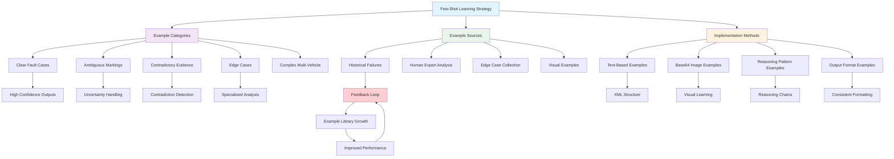

# Chapter 5: Examples and Few-Shot Learning

## Learning Objectives
By the end of this chapter, you will understand:
- The power of examples in steering Claude's behavior
- How to create effective few-shot prompts
- Visual examples with base64 encoding techniques
- Building example libraries for edge cases and difficult scenarios

## Theory

### The Power of Examples

Examples are one of the most powerful mechanisms for steering Claude's behavior. As Christian from Anthropic explains:

> *"Examples or few-shot is a mechanism that really is powerful in steering Claude. You can imagine this in quite a non-trivial way as well."*

### When to Use Examples

Examples become particularly valuable when you have:

1. **Tricky edge cases** that Claude consistently gets wrong
2. **Complex reasoning patterns** you want Claude to follow
3. **Specific output formats** that are hard to describe in text
4. **Domain-specific interpretations** that require human judgment
5. **Gray area scenarios** where the correct answer isn't obvious

### Types of Examples for Our Use Case

For the Swedish car insurance scenario, examples could include:

- **Visual examples**: Base64-encoded images of forms with difficult markings
- **Reasoning examples**: Step-by-step analysis of complex accidents
- **Edge case examples**: Ambiguous markings, contradictory data
- **Output format examples**: Properly structured responses

### The Empirical Science Approach

Examples enable the **empirical science of prompt engineering**:

1. **Collect failure cases** where Claude makes mistakes
2. **Add them as examples** with correct human analysis
3. **Create feedback loops** to improve the system
4. **Build institutional knowledge** that persists across requests

## Code Examples

### Basic Few-Shot Structure

```python
def create_few_shot_examples():
    """
    Create few-shot examples for Swedish car insurance analysis
    """
    
    examples = {
        "example_1": {
            "scenario": "Clear fault determination",
            "input": {
                "form_data": "Vehicle A: No checkboxes marked\nVehicle B: Checkbox 12 marked (failed to yield)",
                "sketch": "Simple intersection, Vehicle B turning left into Vehicle A"
            },
            "analysis": """
            <form_analysis>
            Vehicle A: No violations or actions marked - was proceeding straight
            Vehicle B: Checkbox 12 clearly marked - failed to yield right of way
            </form_analysis>
            
            <sketch_analysis>
            Sketch shows intersection where Vehicle B was making left turn while 
            Vehicle A was going straight. Left-turning vehicle must yield.
            </sketch_analysis>
            
            <final_verdict>
            Vehicle B at fault (95% confidence). Clear violation of right-of-way 
            rules when turning left across straight-through traffic.
            </final_verdict>
            """,
            "lesson": "Clear checkbox violation + corroborating sketch = high confidence"
        },
        
        "example_2": {
            "scenario": "Ambiguous markings - require uncertainty",
            "input": {
                "form_data": "Vehicle A: Light pencil mark near checkbox 3\nVehicle B: Unclear scribble near checkbox 7",
                "sketch": "Illegible sketch with overlapping lines"
            },
            "analysis": """
            <form_analysis>
            Vehicle A: Possible light marking near checkbox 3 (emerging from parking) 
            but mark is too faint to confirm intentional selection
            Vehicle B: Unclear marking near checkbox 7 (right turn) - could be 
            accidental mark or incomplete selection
            </form_analysis>
            
            <sketch_analysis>
            Hand-drawn sketch is illegible with overlapping lines and unclear 
            vehicle positions. Cannot determine sequence or spatial relationships.
            </sketch_analysis>
            
            <final_verdict>
            Insufficient evidence for fault determination (20% confidence). 
            Both form markings and sketch are too ambiguous for reliable analysis.
            </final_verdict>
            """,
            "lesson": "Ambiguous evidence requires explicit uncertainty acknowledgment"
        }
    }
    
    return examples

def format_few_shot_prompt(examples: dict) -> str:
    """
    Format examples into a proper few-shot prompt structure
    """
    
    few_shot_section = "<examples>\n"
    
    for example_id, example_data in examples.items():
        few_shot_section += f"""
        <example id="{example_id}">
        <scenario>{example_data['scenario']}</scenario>
        
        <input>
        Form Data: {example_data['input']['form_data']}
        Sketch: {example_data['input']['sketch']}
        </input>
        
        <expected_analysis>
        {example_data['analysis']}
        </expected_analysis>
        
        <key_lesson>{example_data['lesson']}</key_lesson>
        </example>
        """
    
    few_shot_section += "</examples>\n"
    
    return few_shot_section
```

### Visual Examples with Base64 Encoding

```python
import base64
from PIL import Image
import io

def create_visual_example():
    """
    Create a visual example with base64-encoded image
    """
    
    # Example of base64 encoding for visual examples
    visual_example = {
        "description": "Difficult checkbox marking - light pencil vs intentional mark",
        "image_base64": "data:image/png;base64,iVBORw0KGgoAAAANSUhEUgAAAAEAAAABCAYAAAAfFcSJAAAADUlEQVR42mP8/5+hHgAHggJ/PchI7wAAAABJRU5ErkJggg==",
        "interpretation": """
        This image shows a typical challenging scenario where checkbox 7 has 
        a very light pencil mark. Human analysis determined this WAS an 
        intentional selection based on:
        1. Mark is centered in checkbox area
        2. Consistent with rest of form's pencil darkness  
        3. No other stray marks in that region
        4. Corroborated by sketch showing right turn
        """
    }
    
    return visual_example

def encode_image_to_base64(image_path: str) -> str:
    """
    Convert an image file to base64 for inclusion in prompts
    """
    with open(image_path, "rb") as image_file:
        encoded_string = base64.b64encode(image_file.read()).decode('utf-8')
        return f"data:image/png;base64,{encoded_string}"

# Example usage in system prompt
visual_examples_prompt = """
<visual_examples>
<example_image>
{base64_encoded_image}

Human Expert Analysis:
"The light marking in checkbox 12 should be considered intentional because:
1. It's positioned correctly within the checkbox boundary
2. The pressure/darkness is consistent with other marks on the form
3. The sketch corroborates a failure-to-yield scenario
4. No other explanation for the mark exists"

Key Learning: Light markings can still be intentional - look for consistency 
and corroboration rather than just darkness.
</example_image>
</visual_examples>
"""
```

### Building an Example Library

```python
class ExampleLibrary:
    """
    Manage a library of examples for different scenarios
    """
    
    def __init__(self):
        self.examples = {
            "clear_fault": [],
            "ambiguous_markings": [],
            "contradictory_evidence": [],
            "complex_multi_vehicle": [],
            "edge_cases": []
        }
    
    def add_example(self, category: str, example: dict):
        """Add a new example to the library"""
        if category in self.examples:
            self.examples[category].append(example)
    
    def get_examples_for_scenario(self, scenario_type: str, max_examples: int = 3):
        """Get relevant examples for a specific scenario type"""
        return self.examples.get(scenario_type, [])[:max_examples]
    
    def create_adaptive_prompt(self, detected_scenario: str):
        """
        Create a prompt with examples most relevant to the detected scenario
        """
        relevant_examples = self.get_examples_for_scenario(detected_scenario)
        
        if not relevant_examples:
            return self.get_examples_for_scenario("clear_fault", 2)
        
        return relevant_examples

# Example library initialization
def build_production_example_library():
    """
    Build a comprehensive example library for production use
    """
    
    library = ExampleLibrary()
    
    # Clear fault examples
    library.add_example("clear_fault", {
        "input": "Vehicle A: [], Vehicle B: [checkbox 13 - following too closely]",
        "output": "Vehicle B at fault - rear-end collision, clear following distance violation"
    })
    
    # Ambiguous markings examples  
    library.add_example("ambiguous_markings", {
        "input": "Light marks near checkboxes 3 and 7, sketch unclear",
        "output": "Insufficient evidence - markings too ambiguous for confident determination"
    })
    
    # Contradictory evidence examples
    library.add_example("contradictory_evidence", {
        "input": "Form shows Vehicle A at fault, sketch shows Vehicle B at fault", 
        "output": "Evidence contradiction detected - request additional documentation"
    })
    
    return library
```

## Mermaid Diagram: Few-Shot Learning Architecture



## Example Selection Strategy

### 1. **Quality Over Quantity**
```python
# ✅ 2-3 high-quality, diverse examples
quality_examples = [
    "Clear fault with strong evidence",
    "Ambiguous case requiring uncertainty", 
    "Complex case with multiple factors"
]

# ❌ 10+ similar examples that add little value
quantity_approach = ["Similar rear-end collision"] * 10
```

### 2. **Edge Case Focus**
```python
# ✅ Focus on difficult cases Claude struggles with
edge_cases = [
    "Very light pencil markings",
    "Contradictory form vs sketch data",
    "Multiple vehicles with shared fault",
    "Illegible handwriting scenarios"
]

# ❌ Only easy cases Claude already handles well
easy_cases = ["Clear checkbox violations with obvious fault"]
```

### 3. **Reasoning Pattern Examples**
```python
# ✅ Show the reasoning process, not just answers
reasoning_example = """
<reasoning_process>
1. Examine each checkbox systematically (A1-A17, B1-B17)
2. Identify any traffic violations (checkboxes 12-17)
3. Analyze sketch for spatial relationships
4. Check for consistency between form and sketch
5. Apply traffic law principles
6. Determine confidence level based on evidence clarity
</reasoning_process>
"""

# ❌ Just show final answers without reasoning
answer_only = "Vehicle B at fault"
```

## Real-World Example Scenarios

### Scenario 1: The Light Pencil Mark Challenge
```python
challenging_example = {
    "problem": "Claude consistently missed light pencil marks",
    "solution_example": """
    <example>
    <visual_cue>Very faint mark in checkbox 7 area</visual_cue>
    <human_analysis>
    Despite the light marking, this should be considered intentional because:
    - Mark is centered in checkbox boundary
    - Consistent pressure with other form markings  
    - No eraser marks or corrections nearby
    - Sketch shows right turn action matching checkbox 7
    </human_analysis>
    <confidence_reasoning>
    Faint doesn't mean unintentional. Look for consistency patterns.
    </confidence_reasoning>
    </example>
    """,
    "result": "Claude learned to evaluate mark consistency, not just darkness"
}
```

### Scenario 2: The Contradictory Evidence Problem
```python
contradiction_example = {
    "problem": "Claude would pick one source and ignore contradictions",
    "solution_example": """
    <example>
    <form_data>Vehicle A: Checkbox 13 marked</form_data>
    <sketch_data>Shows Vehicle B rear-ending Vehicle A</sketch_data>
    <human_analysis>
    CONTRADICTION DETECTED: Form suggests Vehicle A was following too 
    closely, but sketch clearly shows Vehicle B hit Vehicle A from behind.
    
    This requires additional investigation:
    - Request clearer sketch or photos
    - Verify form completion accuracy  
    - Consider if both vehicles share fault
    </human_analysis>
    <key_lesson>Always check for consistency between data sources</key_lesson>
    </example>
    """,
    "result": "Claude learned to detect and flag contradictions explicitly"
}
```

## ️ Exercises

### Exercise 1: Example Design
Design three examples for a medical diagnosis system that teaches Claude to:
1. Require multiple symptoms before suggesting a diagnosis
2. Distinguish between urgent and non-urgent cases
3. Handle contradictory patient information

### Exercise 2: Visual Example Creation
Create a visual example (describe the image and analysis) for a document review system that teaches Claude to identify:
- Signatures vs. initials
- Original documents vs. photocopies
- Complete vs. incomplete form sections

### Exercise 3: Failure Case Collection
For your current Claude application, list 5 types of failures that would benefit from few-shot examples.

### Exercise 4: Example Library Architecture
Design a system for automatically collecting and organizing examples from production failures.

## Implementation Guidelines

### Starting Small and Scaling
```python
# Phase 1: Core examples (2-3 essential patterns)
phase_1_examples = [
    "clear_positive_case",
    "clear_negative_case", 
    "uncertainty_example"
]

# Phase 2: Edge cases (5-7 specific problems)
phase_2_examples = [
    "ambiguous_markings",
    "contradictory_evidence",
    "multi_vehicle_complexity"
]

# Phase 3: Production library (10+ categorized examples)
phase_3_examples = {
    "by_scenario": [...],
    "by_difficulty": [...], 
    "by_failure_mode": [...]
}
```

### Example Maintenance
```python
def maintain_example_library():
    """
    Guidelines for keeping examples relevant and effective
    """
    
    maintenance_tasks = [
        "Review examples quarterly for relevance",
        "Add new failure cases as they're discovered", 
        "Remove examples that no longer provide value",
        "Update examples when business rules change",
        "A/B test different example combinations"
    ]
    
    return maintenance_tasks
```

## Next Steps

In [Chapter 6: Detailed Instructions and Order](../06-detailed-instructions/), we'll explore:
- Step-by-step reasoning guidance for Claude
- The critical importance of processing order
- Preventing hallucinations through structured analysis
- Version 4 with comprehensive step-by-step instructions

## Key Takeaways

1. **Examples are powerful behavior steering mechanisms** - use them for complex scenarios
2. **Quality beats quantity** - 2-3 excellent examples outperform 10 mediocre ones
3. **Visual examples work with base64 encoding** - great for forms, images, documents
4. **Build example libraries from real failures** - empirical approach to improvement
5. **Examples enable institutional knowledge** - capture human expertise systematically
6. **Edge cases and gray areas benefit most** - focus examples on difficult scenarios

---

*"You can realistically imagine if you were building this for an insurance company, you'd have tens, maybe even hundreds of examples that are quite difficult, maybe in the gray area, that you'd like to make sure that Claude actually has some basis to make the verdict next time."* - Christian, Anthropic Applied AI Team
