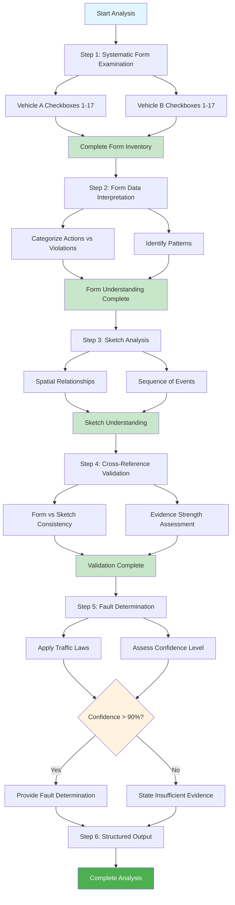

# Chapter 6: Detailed Instructions and Order 📋

## Learning Objectives
By the end of this chapter, you will understand:
- How to provide step-by-step reasoning guidance to Claude
- Why the order of analysis is critically important
- Techniques for preventing hallucinations through structured thinking
- How detailed instructions transform Claude's analytical approach

## 📚 Theory

### The Power of Step-by-Step Instructions

One of the most important insights from the Anthropic tutorial is that **the order in which Claude analyzes information is very important**. This mirrors how humans would approach complex analysis tasks.

As Hannah explains:
> *"If you were a human, you would probably not look at the drawing first and try to understand what was going on, right? It's pretty unclear. It's a bunch of boxes and lines. We don't really know what that drawing is supposed to mean without any additional context."*

### Human-Analogous Reasoning

The correct analytical sequence follows human logic:

1. **Start with structured data** (the form) to establish context
2. **Build understanding systematically** before moving to ambiguous data
3. **Use initial findings** to inform interpretation of unclear information
4. **Cross-reference and validate** findings across data sources
5. **Only then draw conclusions** based on the complete picture

### Preventing Hallucinations Through Structure

Detailed instructions serve multiple purposes:
- **Reduce guesswork** by providing clear methodology
- **Ensure systematic analysis** rather than jumping to conclusions
- **Create checkpoints** for validation and evidence gathering
- **Force explicit reasoning** that can be reviewed and debugged

## 💻 Code Examples

### Version 4: Comprehensive Step-by-Step Instructions

```python
# Version 4 System Prompt - Adding Detailed Instructions
system_prompt_v4 = """
You are an AI assistant helping a human claims adjuster who is reviewing car accident report forms in Swedish.

[... previous background context sections ...]

<detailed_instructions>
Follow this exact sequence when analyzing each case:

STEP 1: SYSTEMATIC FORM EXAMINATION
- Examine the form methodically, checkbox by checkbox
- For Vehicle A: Check each checkbox from 1-17 systematically  
- For Vehicle B: Check each checkbox from 1-17 systematically
- Note the type of marking (X, check, circle, scribble, etc.)
- Identify any unclear or ambiguous markings explicitly
- Create a complete inventory before moving to interpretation

STEP 2: FORM DATA INTERPRETATION
- Identify which actions each vehicle took (checkboxes 1-11)
- Identify any traffic violations (checkboxes 12-17)
- Note any patterns or combinations of checkboxes
- Flag any suspicious or contradictory checkbox combinations
- Do NOT attempt to interpret the sketch yet

STEP 3: SKETCH ANALYSIS
- Now examine the hand-drawn sketch with context from Step 2
- Look for spatial relationships between vehicles
- Identify the sequence of events shown in the sketch
- Note any directional indicators or movement paths
- Assess the clarity and legibility of the sketch

STEP 4: CROSS-REFERENCE AND VALIDATION
- Compare form findings with sketch interpretation
- Look for consistency between checkbox selections and sketch
- Identify any contradictions between data sources
- Note which pieces of evidence are strong vs. weak
- Flag any areas where additional clarification would be helpful

STEP 5: FAULT DETERMINATION
- Apply traffic law principles to the evidence
- Consider primary vs. contributing factors
- Assess the strength of evidence for each conclusion
- Determine confidence level based on evidence clarity
- Only make fault determinations with high confidence (>90%)

STEP 6: STRUCTURED OUTPUT
- Provide your analysis in the required XML format
- Include specific evidence references for all claims
- Explicitly state confidence levels and reasoning
- Highlight any limitations or uncertainties
</detailed_instructions>

<analysis_requirements>
When you examine the form "very carefully" this means:
- Look at each individual checkbox and describe what you see
- Don't skip over unclear markings - describe them explicitly
- Provide the level of detail that shows you've been thorough
- Make a complete list of findings before moving to interpretation

Quality Standards:
- Reference specific checkbox numbers in your reasoning
- Explain why you interpret markings as intentional vs. accidental
- Show your work for fault determination logic
- Acknowledge limitations and areas of uncertainty
</analysis_requirements>
"""

user_prompt_v4 = """
Please analyze the attached Swedish car accident report form and sketch following the detailed step-by-step instructions in your system prompt.

Pay particular attention to:
1. Examining the form very carefully first
2. Creating a complete inventory of all markings
3. Only then moving to sketch analysis
4. Cross-referencing findings before reaching conclusions

Provide your analysis in the specified XML format with complete reasoning.
"""
```

### Implementing Systematic Analysis

```python
def create_systematic_analysis_framework():
    """
    Framework for systematic analysis following the tutorial approach
    """
    
    analysis_steps = {
        "step_1": {
            "name": "Systematic Form Examination",
            "checklist": [
                "Examine Vehicle A checkboxes 1-17 individually",
                "Examine Vehicle B checkboxes 1-17 individually", 
                "Note type of marking for each selection",
                "Identify unclear/ambiguous markings",
                "Create complete inventory before interpretation"
            ],
            "output_format": """
            <form_inventory>
            Vehicle A Markings:
            - Checkbox 1: [Clear X | Light mark | No marking | Unclear]
            - Checkbox 2: [Clear X | Light mark | No marking | Unclear]
            [... continue for all 17 checkboxes]
            
            Vehicle B Markings:
            - Checkbox 1: [Clear X | Light mark | No marking | Unclear]
            [... continue for all 17 checkboxes]
            </form_inventory>
            """
        },
        
        "step_2": {
            "name": "Form Data Interpretation",
            "checklist": [
                "Categorize actions vs. violations",
                "Identify checkbox combinations",
                "Note any contradictions",
                "Do NOT reference sketch yet"
            ],
            "output_format": """
            <form_interpretation>
            Vehicle A Actions: [List of action checkboxes 1-11]
            Vehicle A Violations: [List of violation checkboxes 12-17]
            Vehicle B Actions: [List of action checkboxes 1-11] 
            Vehicle B Violations: [List of violation checkboxes 12-17]
            
            Notable Patterns: [Any significant combinations or contradictions]
            </form_interpretation>
            """
        },
        
        "step_3": {
            "name": "Sketch Analysis",
            "checklist": [
                "Examine with context from form analysis",
                "Identify spatial relationships",
                "Note sequence of events",
                "Assess sketch clarity"
            ]
        },
        
        "step_4": {
            "name": "Cross-Reference Validation",
            "checklist": [
                "Compare form vs. sketch consistency",
                "Identify contradictions",
                "Assess evidence strength",
                "Flag clarification needs"
            ]
        },
        
        "step_5": {
            "name": "Fault Determination", 
            "checklist": [
                "Apply traffic law principles",
                "Consider primary vs. contributing factors",
                "Assess evidence strength",
                "Determine confidence level"
            ]
        }
    }
    
    return analysis_steps

def validate_analysis_completeness(analysis_output: str) -> dict:
    """
    Check if analysis follows the required systematic approach
    """
    
    required_sections = [
        "form_inventory",
        "form_interpretation", 
        "sketch_analysis",
        "cross_reference",
        "fault_determination"
    ]
    
    validation_results = {}
    
    for section in required_sections:
        validation_results[section] = {
            "present": f"<{section}>" in analysis_output,
            "detailed": len(analysis_output.split(f"<{section}>")) > 1
        }
    
    return validation_results
```

### Order-Dependent Analysis Example

```python
# Demonstrating why order matters
def show_order_importance():
    """
    Example showing the difference between correct and incorrect analysis order
    """
    
    incorrect_order = """
    ❌ WRONG APPROACH:
    1. Look at sketch first: "I see two vehicles colliding"
    2. Try to interpret without context: "Looks like vehicle hit another"
    3. Check form to confirm guess: "Let me see if checkboxes support this"
    
    PROBLEMS:
    - Sketch is ambiguous without context
    - Creates confirmation bias
    - Misses important form details
    - Leads to uncertain conclusions
    """
    
    correct_order = """
    ✅ CORRECT APPROACH:
    1. Examine form systematically: "Vehicle A: no markings, Vehicle B: checkbox 12"
    2. Interpret form data: "Vehicle B failed to yield right of way"
    3. Analyze sketch with context: "Sketch shows intersection, confirms B turning left"
    4. Cross-reference: "Form and sketch are consistent"
    5. Conclude: "Clear fault determination - Vehicle B violated right of way"
    
    BENEFITS:
    - Builds understanding incrementally
    - Reduces ambiguity through context
    - Enables confident conclusions
    - Provides systematic evidence trail
    """
    
    return {"incorrect": incorrect_order, "correct": correct_order}
```

## 📊 Mermaid Diagram: Systematic Analysis Flow



## 🎯 Key Instruction Principles

### 1. **Explicit Sequencing**
```python
# ✅ Clear step numbers and dependencies
structured_sequence = [
    "STEP 1: Do X before proceeding",
    "STEP 2: Only after completing Step 1, do Y", 
    "STEP 3: Using results from Steps 1-2, do Z"
]

# ❌ Vague or parallel instructions
vague_instructions = [
    "Look at the form and sketch",
    "Determine what happened",
    "Make a conclusion"
]
```

### 2. **Context Building Before Interpretation**
```python
# ✅ Build context systematically
context_first = """
1. Examine all data sources completely
2. Build understanding of what happened
3. THEN interpret meaning and fault
"""

# ❌ Jump to interpretation too quickly
interpretation_first = """
1. Look at data and determine fault
2. Find evidence to support conclusion
"""
```

### 3. **Explicit Checkpoints**
```python
# ✅ Validation checkpoints between steps
with_checkpoints = """
Step 1: Complete form inventory
CHECKPOINT: Ensure all 17 checkboxes examined for both vehicles

Step 2: Interpret form data  
CHECKPOINT: Categorize actions vs violations before proceeding

Step 3: Analyze sketch
CHECKPOINT: Use form context to guide sketch interpretation
"""
```

## 🔍 Version 4 Results Analysis

### Behavioral Changes

| Aspect | Version 3 | Version 4 |
|--------|-----------|-----------|
| **Analysis Approach** | General examination | Systematic step-by-step ✅ |
| **Detail Level** | Summary findings | Complete checkbox inventory ✅ |
| **Evidence Trail** | Some references | Explicit reasoning chain ✅ |
| **Order Dependency** | Mixed approach | Structured sequence ✅ |
| **Validation** | Implicit | Explicit cross-referencing ✅ |

### Example Output Evolution

```python
# Version 3 (less systematic)
v3_output = """
Claude examines form and sketch simultaneously, provides summary analysis
with some evidence references.
"""

# Version 4 (highly systematic)  
v4_output = """
<form_inventory>
Vehicle A: 
- Checkbox 1: No marking
- Checkbox 2: No marking
[... complete 1-17 examination]

Vehicle B:
- Checkbox 12: Clear X marking (failed to yield)
[... complete systematic review]
</form_inventory>

<form_interpretation>
Vehicle A: No violations or actions marked
Vehicle B: Clear violation - failure to yield right of way
</form_interpretation>

[... continues with sketch analysis, cross-reference, and final determination]
"""
```

## 🛠️ Exercises

### Exercise 1: Instruction Ordering
Reorder these mixed-up analysis steps into the correct sequence:
- [ ] Determine fault based on evidence
- [ ] Cross-reference form and sketch data  
- [ ] Examine individual checkboxes systematically
- [ ] Analyze hand-drawn sketch
- [ ] Interpret checkbox meanings
- [ ] Assess confidence level

### Exercise 2: Checkpoint Design
For a medical diagnosis system, design 5 checkpoints that should occur between analysis steps.

### Exercise 3: Bad Order Example
Write an example showing what goes wrong when Claude analyzes a complex document in the wrong order.

### Exercise 4: Instruction Specificity
Take this vague instruction: "Look at the data and tell me what you think" and convert it into 5 specific, ordered steps.

## 📈 Advanced Instruction Techniques

### 1. **Conditional Logic in Instructions**
```python
conditional_instructions = """
IF checkbox markings are unclear:
    - Describe the ambiguity explicitly
    - Note factors that make interpretation difficult
    - Reduce confidence level accordingly

IF form and sketch contradict:
    - Flag the contradiction immediately
    - Do not attempt to resolve by choosing one source
    - Request additional clarification

IF no clear violations are present:
    - Check for contributing factors
    - Consider shared fault scenarios
    - Require higher evidence threshold for determination
"""
```

### 2. **Quality Control Instructions**
```python
quality_instructions = """
Before providing final output:
- Review each checkbox claim for specific evidence
- Verify all reasoning references actual data points
- Confirm confidence levels match evidence strength
- Check that uncertainty is explicitly acknowledged where appropriate
"""
```

### 3. **Error Prevention Instructions**
```python
error_prevention = """
Common mistakes to avoid:
- Do NOT interpret light markings as "no marking" without consideration
- Do NOT assume checkbox combinations without checking all possibilities
- Do NOT resolve contradictions by ignoring conflicting evidence
- Do NOT provide fault determinations with confidence below 90%
"""
```

## 📈 Next Steps

In [Chapter 7: Output Formatting and Guidelines](../07-output-formatting/), we'll explore:
- Structured output with XML tags for automation
- Application-ready formatting techniques  
- Pre-filled responses and JSON output options
- Final guidelines and reminders for production systems

## 🔑 Key Takeaways

1. **Order matters critically** - build context before interpretation
2. **Step-by-step instructions prevent rushed analysis** - systematic beats intuitive
3. **Explicit checkpoints ensure quality** - validate before proceeding
4. **Detailed instructions show Claude's work** - enables debugging and verification
5. **Human-analogous reasoning patterns work best** - follow logical human analysis sequence
6. **Systematic approaches reduce hallucinations** - structure prevents guesswork

---

*"A really key thing that we found here as we were building this demo and when we were working on the customer example is that the order in which Claude analyzes this information is very important."* - Hannah, Anthropic Applied AI Team
