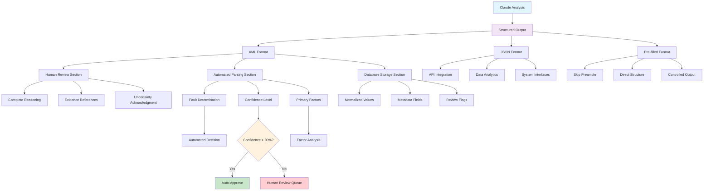

# Chapter 7: Output Formatting and Guidelines 🎨

## Learning Objectives
By the end of this chapter, you will understand:
- How to structure output for automated processing
- XML tags vs. JSON formatting strategies
- Pre-filled responses and output control techniques
- Final guidelines and reminders for production-ready systems

## 📚 Theory

### The Production Reality

As Christian from Anthropic explains:
> *"You can imagine if you're a data engineer working on this LLM application, all the sort of fancy preamble is great, but at the end of the day, you want your piece of information to be stored in, let's say, your SQL database, wherever you want to store that data."*

### Output Formatting Serves Multiple Masters

1. **Human Reviewers**: Need comprehensive reasoning and evidence
2. **Automated Systems**: Need structured, parseable data
3. **Data Storage**: Need consistent schema for databases
4. **Analytics**: Need standardized fields for reporting
5. **Integration**: Need predictable formats for APIs

### The XML Tag Strategy

XML tags provide an excellent solution because they:
- **Contain structured data** for automation
- **Include human-readable reasoning** for review
- **Enable selective parsing** (extract just the verdict)
- **Maintain consistency** across different requests
- **Support debugging** with complete audit trails

## 💻 Code Examples

### Version 5: Production-Ready Output Formatting

```python
# Version 5 System Prompt - Adding Output Formatting Requirements
system_prompt_v5 = """
[... previous sections: task context, background, instructions ...]

<output_formatting_requirements>
You must provide your analysis in this exact XML structure:

<analysis_summary>
[2-3 sentence summary of findings - clear, concise, accurate]
</analysis_summary>

<form_analysis>
<vehicle_a>
[Complete systematic review of Vehicle A checkboxes with specific findings]
</vehicle_a>

<vehicle_b>
[Complete systematic review of Vehicle B checkboxes with specific findings]
</vehicle_b>

<notable_findings>
[Any significant patterns, violations, or ambiguities]
</notable_findings>
</form_analysis>

<sketch_analysis>
<spatial_layout>
[Description of vehicle positions and movement directions]
</spatial_layout>

<sequence_of_events>
[What the sketch shows happened, in chronological order]
</sequence_of_events>

<sketch_clarity>
[Assessment of how clear/reliable the sketch is]
</sketch_clarity>
</sketch_analysis>

<evidence_correlation>
<consistency_check>
[How well form data and sketch align]
</consistency_check>

<contradictions>
[Any discrepancies between data sources, or "None identified"]
</contradictions>

<evidence_strength>
[Overall assessment of evidence quality: Strong/Moderate/Weak]
</evidence_strength>
</evidence_correlation>

<final_verdict>
<fault_determination>[Vehicle A at fault | Vehicle B at fault | Shared fault | Insufficient evidence]</fault_determination>

<confidence_level>[Numerical percentage: 0-100%]</confidence_level>

<reasoning>
[Detailed explanation referencing specific evidence and traffic law principles]
</reasoning>

<primary_factors>
[Main contributing factors to the fault determination]
</primary_factors>

<additional_notes>
[Any limitations, recommendations, or areas needing clarification]
</additional_notes>
</final_verdict>

CRITICAL: You must include ALL sections even if some contain "Not applicable" or "None identified".
</output_formatting_requirements>

<important_guidelines_reminder>
1. Summary must be clear, concise, and accurate - no speculation
2. Base all conclusions on observable evidence from provided materials
3. Reference specific checkbox numbers and sketch elements in reasoning
4. Only provide fault determinations when confidence is >90%
5. If markings are unclear, explicitly state this limitation
6. Maintain professional, factual tone throughout analysis
7. Ensure all XML tags are properly formatted for automated parsing
</important_guidelines_reminder>
"""

user_prompt_v5 = """
Please analyze the attached Swedish car accident report form and sketch following 
all instructions and provide output in the exact XML format specified.

Pay special attention to:
- Complete systematic analysis as instructed
- Proper XML formatting for automated processing
- Clear fault determination with high confidence when evidence supports it
- Explicit acknowledgment of any limitations or uncertainties

Begin your analysis now.
"""
```

### JSON Alternative Formatting

```python
def create_json_output_format():
    """
    Alternative JSON structure for systems preferring JSON over XML
    """
    
    json_format = {
        "analysis_metadata": {
            "timestamp": "ISO timestamp",
            "claude_version": "model version",
            "confidence_threshold": 90
        },
        
        "form_analysis": {
            "vehicle_a": {
                "checkboxes_marked": [1, 7, 12],
                "actions": ["backed_out_parking", "turned_right"],
                "violations": ["failed_to_yield"],
                "ambiguous_markings": []
            },
            "vehicle_b": {
                "checkboxes_marked": [13],
                "actions": [],
                "violations": ["following_too_closely"],
                "ambiguous_markings": []
            }
        },
        
        "sketch_analysis": {
            "clarity_score": 8,  # 1-10 scale
            "spatial_layout": "T-intersection with Vehicle A turning right",
            "sequence_of_events": ["Vehicle A initiated right turn", "Vehicle B approached from behind", "Collision occurred during turn"],
            "reliability": "high"
        },
        
        "evidence_correlation": {
            "form_sketch_consistency": "high",
            "contradictions_detected": false,
            "evidence_strength": "strong"
        },
        
        "verdict": {
            "fault_determination": "vehicle_b_at_fault",
            "confidence_percentage": 95,
            "primary_violation": "following_too_closely", 
            "contributing_factors": ["inadequate_following_distance", "failed_to_adjust_for_turning_vehicle"],
            "reasoning": "Vehicle B clearly violated following distance requirements...",
            "limitations": []
        }
    }
    
    return json_format

# System prompt for JSON output
json_system_prompt = """
[... previous sections ...]

<output_format>
Provide your analysis as valid JSON in exactly this structure:
{json_format}

Ensure:
- All fields are present (use null/empty arrays if not applicable)
- Numbers are numeric types, not strings
- Boolean fields use true/false, not "yes"/"no"
- Text fields are properly escaped
- Overall structure is valid JSON
</output_format>
"""
```

### Pre-filled Response Technique

```python
def demonstrate_prefill_technique():
    """
    Show how to use pre-filled responses to control output format
    """
    
    # Standard approach - Claude decides how to start
    standard_prompt = """
    Analyze this accident report and provide your verdict.
    """
    
    # Pre-filled approach - Claude continues from your starting point
    prefilled_prompt = {
        "user_message": "Analyze this accident report and provide your verdict.",
        "assistant_prefill": "<final_verdict>"
    }
    
    # This forces Claude to immediately start with the verdict XML tag
    # Skips all preamble and goes straight to the structured output
    
    # You can also prefill with JSON structure
    json_prefill = {
        "user_message": "Analyze this accident report.",
        "assistant_prefill": '{"fault_determination": "'
    }
    
    # Claude will complete the JSON structure from that point
    
    return {
        "standard": standard_prompt,
        "xml_prefill": prefilled_prompt,
        "json_prefill": json_prefill
    }
```

### Automated Parsing Examples

```python
import xml.etree.ElementTree as ET
import json
import re

class AccidentAnalysisParser:
    """
    Parse Claude's structured output for automated processing
    """
    
    def parse_xml_output(self, claude_response: str) -> dict:
        """
        Extract structured data from XML-formatted Claude response
        """
        try:
            # Extract the final verdict section
            verdict_match = re.search(r'<final_verdict>(.*?)</final_verdict>', 
                                    claude_response, re.DOTALL)
            
            if not verdict_match:
                return {"error": "No final_verdict section found"}
            
            verdict_xml = f"<final_verdict>{verdict_match.group(1)}</final_verdict>"
            root = ET.fromstring(verdict_xml)
            
            return {
                "fault_determination": root.find('fault_determination').text,
                "confidence_level": int(root.find('confidence_level').text.rstrip('%')),
                "reasoning": root.find('reasoning').text,
                "primary_factors": root.find('primary_factors').text,
                "additional_notes": root.find('additional_notes').text
            }
            
        except Exception as e:
            return {"error": f"Parsing failed: {str(e)}"}
    
    def extract_for_database(self, parsed_data: dict) -> dict:
        """
        Convert parsed data to database-ready format
        """
        return {
            "fault_vehicle": self._normalize_fault_determination(parsed_data.get("fault_determination")),
            "confidence_score": parsed_data.get("confidence_level", 0),
            "reasoning_text": parsed_data.get("reasoning", ""),
            "analysis_timestamp": "2024-01-01T12:00:00Z",
            "claude_version": "claude-3-haiku",
            "requires_human_review": parsed_data.get("confidence_level", 0) < 90
        }
    
    def _normalize_fault_determination(self, raw_determination: str) -> str:
        """
        Normalize fault determination to standard values
        """
        if not raw_determination:
            return "unknown"
            
        raw_lower = raw_determination.lower()
        
        if "vehicle a" in raw_lower:
            return "vehicle_a"
        elif "vehicle b" in raw_lower:
            return "vehicle_b"
        elif "shared" in raw_lower:
            return "shared_fault"
        elif "insufficient" in raw_lower:
            return "insufficient_evidence"
        else:
            return "unknown"

# Usage example
parser = AccidentAnalysisParser()
parsed_result = parser.parse_xml_output(claude_response)
db_record = parser.extract_for_database(parsed_result)
```

## 📊 Mermaid Diagram: Output Formatting Architecture



## 🎯 Output Format Best Practices

### 1. **Complete Structure Always**
```python
# ✅ Always include all required sections
complete_structure = """
<analysis_summary>Even if brief</analysis_summary>
<form_analysis>Even if simple</form_analysis>
<sketch_analysis>Even if unclear</sketch_analysis>
<final_verdict>Always required</final_verdict>
"""

# ❌ Skip sections when they seem irrelevant
incomplete_structure = """
<final_verdict>Vehicle B at fault</final_verdict>
<!-- Missing other required sections -->
"""
```

### 2. **Parseable Values**
```python
# ✅ Standardized, parseable values
standardized_values = {
    "fault_determination": ["Vehicle A at fault", "Vehicle B at fault", "Shared fault", "Insufficient evidence"],
    "confidence_level": "95%",  # Always include % symbol
    "evidence_strength": ["Strong", "Moderate", "Weak"]
}

# ❌ Inconsistent or unparseable values  
inconsistent_values = {
    "fault_determination": "I think Vehicle B might be responsible",
    "confidence_level": "Pretty sure",
    "evidence_strength": "It's okay I guess"
}
```

### 3. **Automation-Friendly Tags**
```python
# ✅ Clear, consistent tag names
automation_friendly = """
<fault_determination>Vehicle B at fault</fault_determination>
<confidence_level>95%</confidence_level>
<primary_factors>Failed to yield right of way</primary_factors>
"""

# ❌ Ambiguous or inconsistent tags
automation_unfriendly = """
<conclusion>Vehicle B seems to be the problem</conclusion>
<how_sure>Very confident</how_sure>
<why>Didn't follow rules</why>
"""
```

## 🔍 Version 5 Production Results

### Integration Benefits

| Aspect | Before Formatting | After Formatting |
|--------|------------------|------------------|
| **Automated Processing** | Manual extraction needed | Direct XML/JSON parsing ✅ |
| **Database Storage** | Custom parsing required | Standardized schema ✅ |
| **Human Review** | Full text review | Focused on verdict section ✅ |
| **Analytics** | Inconsistent data | Normalized values ✅ |
| **API Integration** | Custom formatting | Standard structure ✅ |

### Example Production Workflow

```python
def production_workflow_example():
    """
    Show how formatted output integrates into production systems
    """
    
    workflow = {
        "step_1": {
            "action": "Claude analyzes accident report",
            "output": "Structured XML response with all required sections"
        },
        
        "step_2": {
            "action": "Automated parser extracts key data",
            "output": "fault_determination, confidence_level, reasoning, factors"
        },
        
        "step_3": {
            "action": "Decision routing based on confidence",
            "logic": "If confidence > 90%: auto-process, else: human review queue"
        },
        
        "step_4": {
            "action": "Database storage with normalized schema",
            "fields": "case_id, fault_vehicle, confidence_score, analysis_text, timestamp"
        },
        
        "step_5": {
            "action": "Analytics and reporting",
            "capabilities": "Fault patterns, confidence trends, processing volumes"
        }
    }
    
    return workflow
```

## 🛠️ Exercises

### Exercise 1: Output Structure Design
Design output formats for these scenarios:
1. Medical diagnosis system (structured for EMR integration)
2. Legal document review (structured for case management)
3. Technical troubleshooting (structured for ticket systems)

### Exercise 2: Parsing Implementation
Write code to parse Claude's XML output and extract:
- Fault determination
- Confidence level
- Evidence strength
- Human review requirements

### Exercise 3: Error Handling
Design error handling for when Claude's output:
- Has malformed XML
- Missing required sections
- Contains unparseable values
- Exceeds expected length limits

### Exercise 4: Pre-fill Strategy
Design pre-fill approaches for:
- Forcing JSON output format
- Skipping reasoning and going straight to verdict
- Ensuring specific confidence level formatting

## 📈 Advanced Output Techniques

### 1. **Conditional Output Sections**
```python
conditional_output = """
<analysis_summary>Always required</analysis_summary>

<!-- Only include if markings are ambiguous -->
<ambiguity_assessment>
[Detailed analysis of unclear markings]
</ambiguity_assessment>

<!-- Only include if contradiction detected -->
<contradiction_analysis>
[Analysis of conflicting evidence]
</contradiction_analysis>

<final_verdict>Always required</final_verdict>
"""
```

### 2. **Metadata Enrichment**
```python
metadata_enriched = """
<analysis_metadata>
<processing_time>2.3 seconds</processing_time>
<complexity_score>7</complexity_score>
<data_quality>high</data_quality>
<requires_escalation>false</requires_escalation>
</analysis_metadata>

[... rest of analysis ...]
"""
```

### 3. **Multi-Format Output**
```python
multi_format = """
<!-- Human-readable summary -->
<summary>Vehicle B at fault due to failure to yield</summary>

<!-- Machine-readable data -->
<structured_data>
{
  "fault_vehicle": "B",
  "violation_code": "FTY001",
  "confidence": 0.95,
  "review_required": false
}
</structured_data>

<!-- Audit trail -->
<evidence_trail>
[Detailed reasoning for compliance/legal review]
</evidence_trail>
"""
```

## 📈 Next Steps

In [Chapter 8: Advanced Techniques](../08-advanced-techniques/), we'll explore:
- Extended thinking and reasoning capabilities
- Prompt caching strategies for performance
- Real-world implementation considerations
- Future-proofing your prompt engineering approach

## 🔑 Key Takeaways

1. **Output formatting serves multiple stakeholders** - humans, systems, databases, APIs
2. **XML tags provide excellent structure** - readable and parseable
3. **Standardized values enable automation** - consistent schema for processing
4. **Pre-filled responses control output start** - skip preamble, go straight to structure
5. **Complete structure always** - include all sections even if not applicable
6. **Design for integration from day one** - consider downstream processing needs

---

*"You can imagine if you're a data engineer working on this LLM application, all the sort of fancy preamble is great, but at the end of the day, you want your piece of information to be stored in, let's say, your SQL database, wherever you want to store that data."* - Christian, Anthropic Applied AI Team
