# Chapter 8: Advanced Techniques

## Learning Objectives
By the end of this chapter, you will understand:
- Extended thinking and reasoning capabilities in Claude
- Prompt caching strategies for performance optimization
- Real-world implementation considerations
- Future-proofing your prompt engineering approach

## Theory

### Extended Thinking: The Reasoning Revolution

As Christian from Anthropic explains:
> *"Both Claude 3.5 and especially Claude 3.5 Sonnet is a sort of hybrid reasoning model meaning that there's extended thinking at your disposal."*

Extended thinking allows Claude to:
- **Think before responding** with explicit reasoning steps
- **Show its work** in `<thinking>` tags that you can analyze
- **Reason through complex problems** more systematically
- **Provide insights** into how it approaches your specific data

### Extended Thinking as a Prompt Engineering Tool

This capability serves as a **"crutch for your prompt engineering"**:

1. **Analyze Claude's reasoning process** in the thinking transcript
2. **Identify reasoning patterns** that work well for your domain
3. **Extract successful approaches** and build them into your system prompt
4. **Improve token efficiency** by providing explicit reasoning paths
5. **Debug failures** by seeing where Claude's thinking went wrong

### Prompt Caching: Performance Optimization

For production systems, prompt caching becomes critical:
- **Static information** (form structures, legal frameworks) can be cached
- **Repeated requests** become much faster and cheaper
- **Consistent understanding** across all requests
- **Reduced latency** for real-time applications

## Code Examples

### Extended Thinking Implementation

```python
def enable_extended_thinking():
    """
    Configure Claude to use extended thinking for complex analysis
    """
    
    # Enable extended thinking in API request
    api_request = {
        "model": "claude-3-5-sonnet-20241022",
        "messages": [...],
        "thinking": True,  # Enable extended thinking
        "max_tokens": 4000
    }
    
    return api_request

def analyze_thinking_transcript(claude_response: dict):
    """
    Extract insights from Claude's thinking process
    """
    
    thinking_content = claude_response.get("thinking", "")
    
    analysis = {
        "reasoning_steps": extract_reasoning_steps(thinking_content),
        "decision_points": identify_decision_points(thinking_content),
        "uncertainty_areas": find_uncertainty_markers(thinking_content),
        "evidence_evaluation": track_evidence_usage(thinking_content)
    }
    
    return analysis

def extract_reasoning_steps(thinking_text: str) -> list:
    """
    Identify the step-by-step reasoning Claude used
    """
    
    # Look for common reasoning patterns
    step_patterns = [
        r"First, I should (.+?)\.?(?=Next|Then|Now|Finally|\n\n)",
        r"Next, I need to (.+?)\.?(?=Then|Now|Finally|\n\n)",
        r"Then I'll (.+?)\.?(?=Finally|Now|\n\n)",
        r"Finally, I should (.+?)\.?(?=\n\n|\Z)"
    ]
    
    steps = []
    for pattern in step_patterns:
        matches = re.findall(pattern, thinking_text, re.DOTALL | re.IGNORECASE)
        steps.extend(matches)
    
    return steps

# Example of using thinking insights to improve prompts
def improve_prompt_from_thinking():
    """
    Example of how thinking transcripts improve prompt engineering
    """
    
    original_prompt = """
    Analyze this accident report and determine fault.
    """
    
    # After analyzing Claude's thinking transcript
    thinking_insights = """
    Claude's thinking process revealed:
    1. It systematically checks each checkbox 1-17 for both vehicles
    2. It categorizes violations vs. actions 
    3. It cross-references form data with sketch
    4. It applies specific traffic law principles
    5. It evaluates evidence strength before concluding
    """
    
    improved_prompt = """
    Analyze this accident report following this systematic approach:
    
    1. Examine checkboxes 1-17 systematically for both vehicles
    2. Categorize findings into actions vs. traffic violations
    3. Cross-reference form data with sketch information
    4. Apply relevant traffic law principles (right-of-way, following distance, etc.)
    5. Evaluate evidence strength before making fault determination
    
    Only conclude fault when evidence is strong and confidence is >90%.
    """
    
    return {
        "original": original_prompt,
        "insights": thinking_insights,
        "improved": improved_prompt
    }
```

### Prompt Caching Implementation

```python
import hashlib
import json
from typing import Dict, Optional

class PromptCacheManager:
    """
    Manage prompt caching for performance optimization
    """
    
    def __init__(self):
        self.cache = {}
        self.static_components = {}
    
    def register_static_component(self, name: str, content: str):
        """
        Register static content that can be cached across requests
        """
        self.static_components[name] = {
            "content": content,
            "hash": hashlib.md5(content.encode()).hexdigest(),
            "cacheable": True
        }
    
    def build_cacheable_prompt(self, dynamic_content: str) -> Dict:
        """
        Build a prompt optimized for caching
        """
        
        # Static components (cacheable)
        static_sections = [
            self.static_components.get("form_structure", {}).get("content", ""),
            self.static_components.get("legal_framework", {}).get("content", ""),
            self.static_components.get("domain_knowledge", {}).get("content", ""),
            self.static_components.get("examples", {}).get("content", "")
        ]
        
        cacheable_system_prompt = "\n\n".join(filter(None, static_sections))
        
        # Dynamic content (not cacheable)
        dynamic_user_prompt = f"""
        Please analyze the following accident report according to your instructions:
        
        {dynamic_content}
        
        Provide your analysis in the required XML format.
        """
        
        return {
            "system_prompt": cacheable_system_prompt,
            "user_prompt": dynamic_user_prompt,
            "cache_key": hashlib.md5(cacheable_system_prompt.encode()).hexdigest()
        }
    
    def optimize_for_caching(self):
        """
        Guidelines for cache-optimized prompt design
        """
        
        optimization_strategy = {
            "static_in_system": [
                "Form structure definitions",
                "Legal framework rules", 
                "Domain knowledge",
                "Example cases",
                "Analysis instructions"
            ],
            
            "dynamic_in_user": [
                "Specific accident data",
                "Images/attachments",
                "User preferences",
                "Request-specific instructions"
            ],
            
            "cache_benefits": [
                "Reduced token processing costs",
                "Faster response times",
                "Consistent interpretation",
                "Better performance at scale"
            ]
        }
        
        return optimization_strategy

# Example usage
cache_manager = PromptCacheManager()

# Register static components
cache_manager.register_static_component("form_structure", """
<form_structure>
Swedish car accident form contains 17 standardized checkboxes:
1. Backed out of parking space/garage
2. Opened car door into traffic
[... complete definitions ...]
</form_structure>
""")

cache_manager.register_static_component("legal_framework", """
<legal_framework>
Swedish traffic law principles:
- Right-of-way rules at intersections
- Following distance requirements
- Turning vehicle responsibilities
</legal_framework>
""")

# Build cacheable prompt
accident_data = "Vehicle A: checkbox 1 marked, Vehicle B: checkbox 12 marked"
prompt_structure = cache_manager.build_cacheable_prompt(accident_data)
```

### Real-World Implementation Architecture

```python
class ProductionPromptSystem:
    """
    Production-ready prompt engineering system
    """
    
    def __init__(self):
        self.cache_manager = PromptCacheManager()
        self.performance_monitor = PerformanceMonitor()
        self.quality_validator = QualityValidator()
        self.fallback_handler = FallbackHandler()
    
    def process_accident_claim(self, claim_data: Dict) -> Dict:
        """
        Complete production workflow for accident claim processing
        """
        
        try:
            # Step 1: Build optimized prompt
            prompt_structure = self.cache_manager.build_cacheable_prompt(
                claim_data["raw_data"]
            )
            
            # Step 2: Call Claude with caching
            response = self.call_claude_with_cache(prompt_structure)
            
            # Step 3: Parse and validate output
            parsed_result = self.quality_validator.parse_and_validate(response)
            
            # Step 4: Performance monitoring
            self.performance_monitor.log_request({
                "cache_hit": prompt_structure.get("cache_hit", False),
                "response_time": response.get("processing_time", 0),
                "confidence_level": parsed_result.get("confidence_level", 0)
            })
            
            # Step 5: Route based on confidence
            return self.route_based_on_confidence(parsed_result)
            
        except Exception as e:
            # Step 6: Fallback handling
            return self.fallback_handler.handle_failure(e, claim_data)
    
    def call_claude_with_cache(self, prompt_structure: Dict) -> Dict:
        """
        Call Claude API with caching optimization
        """
        
        # Check cache first
        cache_key = prompt_structure["cache_key"]
        if cache_key in self.cache_manager.cache:
            # Use cached system prompt understanding
            cached_context = self.cache_manager.cache[cache_key]
            
            api_request = {
                "model": "claude-3-5-sonnet-20241022",
                "system": cached_context["system_prompt"],
                "messages": [{"role": "user", "content": prompt_structure["user_prompt"]}],
                "thinking": True,  # Enable for complex cases
                "cache": {"type": "ephemeral"}  # Use prompt caching
            }
        else:
            # First time - will be cached for subsequent requests
            api_request = {
                "model": "claude-3-5-sonnet-20241022", 
                "system": prompt_structure["system_prompt"],
                "messages": [{"role": "user", "content": prompt_structure["user_prompt"]}],
                "thinking": True,
                "cache": {"type": "ephemeral"}
            }
        
        # Make API call (pseudo-code)
        response = claude_api.call(api_request)
        
        return response
    
    def route_based_on_confidence(self, analysis_result: Dict) -> Dict:
        """
        Route decisions based on confidence levels
        """
        
        confidence = analysis_result.get("confidence_level", 0)
        
        if confidence >= 95:
            return {
                "status": "auto_approved",
                "action": "process_payment",
                "human_review": False,
                "result": analysis_result
            }
        elif confidence >= 80:
            return {
                "status": "supervisor_review",
                "action": "escalate_to_supervisor", 
                "human_review": True,
                "result": analysis_result
            }
        else:
            return {
                "status": "full_human_review",
                "action": "assign_to_adjuster",
                "human_review": True,
                "result": analysis_result
            }
```

## Mermaid Diagram: Advanced Techniques Architecture

```mermaid
flowchart TD
    A[Production Prompt System] --> B[Extended Thinking]
    A --> C[Prompt Caching]
    A --> D[Performance Monitoring]
    A --> E[Quality Validation]
    
    B --> F[Enable Thinking Mode]
    B --> G[Analyze Reasoning Transcript]
    B --> H[Extract Successful Patterns]
    B --> I[Improve System Prompts]
    
    C --> J[Static Component Caching]
    C --> K[Dynamic Content Processing]
    C --> L[Cache Key Management]
    C --> M[Performance Optimization]
    
    D --> N[Response Time Tracking]
    D --> O[Confidence Level Monitoring]
    D --> P[Cache Hit Rate Analysis]
    D --> Q[Error Rate Tracking]
    
    E --> R[Output Structure Validation]
    E --> S[Confidence Threshold Checking]
    E --> T[Evidence Reference Verification]
    E --> U[Automated Quality Scores]
    
    F --> V[Complex Problem Solving]
    G --> W[Reasoning Insights]
    H --> X[Pattern Library]
    I --> Y[Iterative Improvement]
    
    J --> Z[Form Definitions]
    J --> AA[Legal Framework]
    J --> BB[Domain Knowledge]
    K --> CC[Accident-Specific Data]
    
    N --> DD[Performance Dashboard]
    R --> EE[Quality Dashboard]
    
    V --> FF[Better Analysis Quality]
    Z --> GG[Faster Processing]
    DD --> HH[System Optimization]
    EE --> II[Continuous Improvement]
    
    style A fill:#e1f5fe
    style B fill:#e8f5e8
    style C fill:#fff3e0
    style D fill:#f3e5f5
    style E fill:#fce4ec
```



## Advanced Optimization Strategies

### 1. **Adaptive Prompt Selection**
```python
def select_optimal_prompt(request_characteristics: Dict) -> str:
    """
    Choose the best prompt variant based on request characteristics
    """
    
    if request_characteristics["complexity"] == "high":
        return "detailed_systematic_prompt_with_thinking"
    elif request_characteristics["ambiguity"] == "high":
        return "uncertainty_focused_prompt"
    elif request_characteristics["speed_priority"] == "high":
        return "streamlined_prompt_with_prefill"
    else:
        return "standard_comprehensive_prompt"

# Characteristics detection
def analyze_request_characteristics(accident_data: str) -> Dict:
    """
    Analyze incoming data to determine optimal prompt strategy
    """
    
    characteristics = {
        "complexity": "low",
        "ambiguity": "low", 
        "speed_priority": "low"
    }
    
    # Complexity indicators
    if len(accident_data.split()) > 500:
        characteristics["complexity"] = "high"
    
    # Ambiguity indicators  
    ambiguity_keywords = ["unclear", "light mark", "illegible", "smudged"]
    if any(keyword in accident_data.lower() for keyword in ambiguity_keywords):
        characteristics["ambiguity"] = "high"
    
    return characteristics
```

### 2. **Continuous Learning from Thinking Transcripts**
```python
class ThinkingAnalyzer:
    """
    Analyze thinking transcripts to improve prompt engineering
    """
    
    def __init__(self):
        self.successful_patterns = []
        self.failure_patterns = []
        self.reasoning_library = {}
    
    def analyze_successful_case(self, thinking_transcript: str, outcome: Dict):
        """
        Extract successful reasoning patterns
        """
        
        if outcome["confidence_level"] > 90 and outcome["human_validation"] == "correct":
            reasoning_steps = self.extract_reasoning_structure(thinking_transcript)
            self.successful_patterns.append({
                "pattern": reasoning_steps,
                "context": outcome["case_type"],
                "effectiveness": outcome["confidence_level"]
            })
    
    def build_reasoning_guidance(self) -> str:
        """
        Build explicit reasoning guidance from successful patterns
        """
        
        common_patterns = self.find_common_successful_patterns()
        
        guidance = """
        <reasoning_guidance>
        Based on analysis of successful cases, follow this reasoning pattern:
        
        """
        
        for i, pattern in enumerate(common_patterns, 1):
            guidance += f"{i}. {pattern['description']}\n"
        
        guidance += "</reasoning_guidance>"
        
        return guidance
    
    def find_common_successful_patterns(self) -> list:
        """
        Identify the most effective reasoning patterns
        """
        
        # Analyze patterns that appear in >80% of successful cases
        pattern_frequency = {}
        
        for case in self.successful_patterns:
            for step in case["pattern"]:
                pattern_frequency[step] = pattern_frequency.get(step, 0) + 1
        
        total_cases = len(self.successful_patterns)
        common_patterns = [
            {"description": pattern, "frequency": count/total_cases}
            for pattern, count in pattern_frequency.items()
            if count/total_cases > 0.8
        ]
        
        return sorted(common_patterns, key=lambda x: x["frequency"], reverse=True)
```

### 3. **A/B Testing for Prompt Optimization**
```python
class PromptABTester:
    """
    A/B test different prompt variations
    """
    
    def __init__(self):
        self.variants = {}
        self.results = {}
    
    def register_variant(self, variant_name: str, prompt_content: str):
        """
        Register a prompt variant for testing
        """
        self.variants[variant_name] = {
            "content": prompt_content,
            "tests": 0,
            "successes": 0,
            "avg_confidence": 0,
            "avg_response_time": 0
        }
    
    def run_test(self, request_data: Dict) -> Dict:
        """
        Run A/B test on prompt variants
        """
        
        # Select variant (round-robin, random, or weighted)
        variant_name = self.select_test_variant()
        variant = self.variants[variant_name]
        
        # Process with selected variant
        result = self.process_with_variant(variant, request_data)
        
        # Record results
        self.record_test_result(variant_name, result)
        
        return {
            "result": result,
            "variant_used": variant_name,
            "test_metadata": self.get_test_metadata(variant_name)
        }
    
    def analyze_results(self) -> Dict:
        """
        Analyze A/B test results to find best performing variant
        """
        
        analysis = {}
        
        for variant_name, stats in self.variants.items():
            if stats["tests"] > 0:
                analysis[variant_name] = {
                    "success_rate": stats["successes"] / stats["tests"],
                    "avg_confidence": stats["avg_confidence"],
                    "avg_response_time": stats["avg_response_time"],
                    "total_tests": stats["tests"]
                }
        
        # Find best performing variant
        best_variant = max(analysis.items(), 
                          key=lambda x: x[1]["success_rate"] * x[1]["avg_confidence"])
        
        return {
            "analysis": analysis,
            "best_variant": best_variant[0],
            "improvement": self.calculate_improvement(analysis)
        }
```

## Real-World Considerations

### Scalability Challenges
```python
scalability_considerations = {
    "high_volume": {
        "challenge": "Processing thousands of requests per hour",
        "solutions": [
            "Aggressive prompt caching",
            "Batch processing where possible", 
            "Load balancing across multiple API keys",
            "Tiered confidence routing"
        ]
    },
    
    "cost_optimization": {
        "challenge": "Managing API costs at scale",
        "solutions": [
            "Cache static prompt components",
            "Use cheaper models for high-confidence cases",
            "Implement request throttling",
            "Monitor token usage closely"
        ]
    },
    
    "quality_consistency": {
        "challenge": "Maintaining quality across all requests",
        "solutions": [
            "Comprehensive validation pipelines",
            "Random quality sampling",
            "Automated quality scoring",
            "Continuous monitoring and alerting"
        ]
    }
}
```

### Integration Patterns
```python
def design_integration_architecture():
    """
    Common patterns for integrating Claude into existing systems
    """
    
    patterns = {
        "api_gateway_pattern": {
            "description": "Central API gateway routes requests to Claude",
            "benefits": ["Centralized authentication", "Rate limiting", "Monitoring"],
            "use_cases": ["Multiple internal applications", "External API exposure"]
        },
        
        "event_driven_pattern": {
            "description": "Claude processes events from message queues",
            "benefits": ["Asynchronous processing", "Scalability", "Reliability"],
            "use_cases": ["High volume processing", "Background analysis"]
        },
        
        "microservice_pattern": {
            "description": "Claude wrapped in dedicated microservice",
            "benefits": ["Service isolation", "Independent deployment", "Technology flexibility"],
            "use_cases": ["Complex enterprise architectures", "Multi-team development"]
        }
    }
    
    return patterns
```

## ️ Exercises

### Exercise 1: Extended Thinking Analysis
Enable extended thinking for a complex prompt and analyze the reasoning transcript to identify:
1. The sequence of steps Claude follows
2. Decision points where Claude evaluates alternatives
3. Areas where Claude expresses uncertainty
4. Successful reasoning patterns to extract

### Exercise 2: Cache Optimization Design
Design a caching strategy for these scenarios:
1. Legal document analysis (case law, regulations, precedents)
2. Medical diagnosis assistance (symptoms, protocols, guidelines)
3. Technical troubleshooting (error codes, solutions, procedures)

### Exercise 3: Production Architecture
Design a complete production system including:
- Prompt caching strategy
- Quality validation pipeline
- Performance monitoring
- Error handling and fallbacks
- A/B testing framework

### Exercise 4: Continuous Improvement System
Create a system that:
- Collects feedback on Claude's outputs
- Identifies failure patterns
- Automatically suggests prompt improvements
- Tests improvements before deployment

## Future-Proofing Strategies

### 1. **Model Agnostic Design**
```python
# Design prompts that work across different models
model_agnostic_principles = [
    "Use clear, explicit instructions",
    "Avoid model-specific syntax",  
    "Design for reasoning over memorization",
    "Include comprehensive examples",
    "Test across different model versions"
]
```

### 2. **Monitoring and Alerting**
```python
def setup_production_monitoring():
    """
    Essential monitoring for production prompt systems
    """
    
    metrics = {
        "performance": ["response_time", "cache_hit_rate", "error_rate"],
        "quality": ["confidence_levels", "human_override_rate", "accuracy_scores"],
        "business": ["throughput", "cost_per_request", "user_satisfaction"]
    }
    
    alerts = {
        "critical": ["error_rate > 5%", "response_time > 30s"],
        "warning": ["confidence_drop > 10%", "cache_miss > 50%"],
        "info": ["volume_spike", "new_error_patterns"]
    }
    
    return {"metrics": metrics, "alerts": alerts}
```

### 3. **Continuous Learning Architecture**
```python
def design_learning_system():
    """
    System for continuous prompt improvement
    """
    
    learning_components = {
        "feedback_collection": "Gather human validation data",
        "pattern_analysis": "Identify successful/failed patterns", 
        "prompt_generation": "Generate improved prompt variants",
        "testing_framework": "A/B test new variants safely",
        "deployment_pipeline": "Roll out improvements gradually"
    }
    
    return learning_components
```

## Key Takeaways

1. **Extended thinking enables deeper analysis** - use it for complex scenarios and prompt optimization
2. **Prompt caching is essential for production** - separate static from dynamic content
3. **Performance monitoring drives improvements** - measure what matters
4. **Quality validation prevents failures** - validate structure, confidence, and evidence
5. **Continuous learning from thinking transcripts** - extract successful patterns systematically
6. **Design for scale from day one** - consider volume, cost, and consistency requirements
7. **Future-proof with model-agnostic approaches** - focus on clear reasoning over model-specific tricks

## Conclusion

You've now completed the comprehensive Claude Code Prompting 101 course! From basic prompts that confused car accidents with skiing accidents, to production-ready systems that confidently analyze complex insurance claims with structured output and automated processing.

### Your Journey Summary:
- **Chapter 1**: Understanding the iterative nature of prompt engineering
- **Chapter 2**: Building structured, organized prompts  
- **Chapter 3**: Setting clear task and tone context
- **Chapter 4**: Providing comprehensive background knowledge
- **Chapter 5**: Using examples for steering behavior
- **Chapter 6**: Implementing systematic step-by-step analysis
- **Chapter 7**: Formatting output for production systems
- **Chapter 8**: Advanced optimization and scaling techniques

### Next Steps:
1. Apply these techniques to your own use cases
2. Start with simple prompts and iterate systematically
3. Measure performance and quality consistently
4. Build example libraries from real failures
5. Design for production scalability from the beginning

---

*"The empirical science of prompt engineering - you sort of always want to push the limits of your application and get that feedback loop in where it's going wrong and try to add that into system prompt so that next time when example that sort of mimics that takes place it's able to actually reference it in its example set."* - Christian, Anthropic Applied AI Team
