# Claude Code Prompting 101: Complete Course Overview 🗺️

Below is a comprehensive mindmap of the entire Claude Code Prompting 101 course structure and concepts.

```mermaid
mindmap
  root((Claude Code Prompting 101))
    
    Chapter 1: Introduction
      ::icon(fa fa-play-circle)
      What is Prompt Engineering
        Clear Instructions
        Context Provision
        Information Arrangement
      Iterative Nature
        Start Simple
        Test & Observe
        Refine & Improve
        Empirical Science
      Use Case: Swedish Insurance
        Car Accident Analysis
        Form Processing
        Fault Determination
      Problem: Basic Prompt
        Skiing vs Car Confusion
        Lack of Context
        Vague Instructions
    
    Chapter 2: Prompt Structure
      ::icon(fa fa-building)
      10-Point Framework
        Task Description
        Content
        Detailed Instructions
        Examples
        Reminders
      System vs User Prompts
        Static Information
        Dynamic Content
        Clear Separation
      XML Organization
        Structured Tags
        Claude Preferences
        Clear Delimiters
      API vs Conversational
        Single-Shot Success
        Production Ready
        Consistent Results
    
    Chapter 3: Task & Tone Context
      ::icon(fa fa-bullseye)
      Task Context Components
        Role Definition
        Domain Specification
        Objective Clarification
        Scope Boundaries
      Tone Guidelines
        Confidence Requirements
        Factual Accuracy
        Error Handling
        Professional Style
      Version 2 Improvements
        Domain Recognition
        Appropriate Caution
        Evidence Requirements
        Uncertainty Handling
    
    Chapter 4: Background Context
      ::icon(fa fa-database)
      Static vs Dynamic
        Form Structure
        Legal Framework
        Domain Rules
        Request-Specific Data
      XML Organization
        Background Information
        Form Specifications
        Human Patterns
        Interpretation Guidelines
      Version 3 Breakthrough
        Complete Form Knowledge
        High Confidence
        Specific References
        Fast Processing
      Prompt Caching
        Performance Benefits
        Consistent Understanding
        Cost Optimization
    
    Chapter 5: Examples & Few-Shot
      ::icon(fa fa-lightbulb)
      Power of Examples
        Behavior Steering
        Edge Case Handling
        Pattern Teaching
        Gray Area Guidance
      Example Types
        Text-Based
        Visual Base64
        Reasoning Patterns
        Output Formats
      Example Library
        Clear Fault Cases
        Ambiguous Markings
        Contradictory Evidence
        Complex Scenarios
      Empirical Science
        Failure Collection
        Feedback Loops
        Continuous Improvement
    
    Chapter 6: Detailed Instructions
      ::icon(fa fa-list-ol)
      Systematic Analysis
        Step-by-Step Process
        Explicit Sequencing
        Context Building
        Validation Checkpoints
      Order Importance
        Form First
        Sketch Second
        Cross-Reference
        Evidence-Based Conclusion
      Version 4 Results
        Complete Inventory
        Systematic Approach
        Evidence Trail
        Quality Validation
      Human-Analogous Reasoning
        Logical Sequence
        Incremental Understanding
        Structured Thinking
    
    Chapter 7: Output Formatting
      ::icon(fa fa-code)
      Production Requirements
        Automated Processing
        Database Storage
        Human Review
        API Integration
      XML vs JSON
        Structured Tags
        Parseable Values
        Consistent Schema
        Integration Ready
      Pre-filled Responses
        Skip Preamble
        Direct Structure
        Controlled Output
      Version 5 Complete
        Structured Analysis
        Automation Ready
        Quality Assured
    
    Chapter 8: Advanced Techniques
      ::icon(fa fa-rocket)
      Extended Thinking
        Reasoning Transcripts
        Pattern Analysis
        Prompt Optimization
        Quality Insights
      Prompt Caching
        Static Components
        Performance Gains
        Cost Reduction
        Scalability
      Production Architecture
        Quality Validation
        Performance Monitoring
        Error Handling
        Continuous Learning
      Future-Proofing
        Model Agnostic Design
        Monitoring Systems
        A/B Testing
        Continuous Improvement
    
    Key Outcomes
      ::icon(fa fa-trophy)
      Journey Progression
        Skiing → Car Accidents
        Uncertain → Confident
        Manual → Automated
        Basic → Production-Ready
      Performance Metrics
        95% Confidence Levels
        Structured Output
        Fast Processing
        Scalable Architecture
      Best Practices
        Iterative Development
        Evidence-Based Reasoning
        Systematic Validation
        Continuous Optimization
```

## Learning Path Visualization

```mermaid
flowchart LR
    A[Basic Prompt<br/>❌ Skiing Accident] --> B[Add Structure<br/>✅ Car Accident]
    B --> C[Task & Tone<br/>✅ Appropriate Caution]
    C --> D[Background Context<br/>✅ High Confidence]
    D --> E[Examples<br/>✅ Edge Case Handling]
    E --> F[Detailed Instructions<br/>✅ Systematic Analysis]
    F --> G[Output Formatting<br/>✅ Production Ready]
    G --> H[Advanced Techniques<br/>✅ Scalable System]
    
    style A fill:#ffcdd2
    style H fill:#c8e6c9
```

## Confidence Progression

## Iterative Improvement Cycle

```mermaid
flowchart TD
    A[Test Current Prompt] --> B{Results Satisfactory?}
    B -->|No| C[Identify Issues]
    B -->|Yes| D[Production Ready]
    C --> E[Apply Framework Component]
    E --> F[Structure/Context/Instructions]
    F --> A
    
    C --> G[Common Issues]
    G --> H[Domain Confusion<br/>→ Add Task Context]
    G --> I[Low Confidence<br/>→ Add Background Info]
    G --> J[Inconsistent Output<br/>→ Add Formatting Rules]
    G --> K[Edge Case Failures<br/>→ Add Examples]
    
    style D fill:#c8e6c9
    style G fill:#fff3e0
```

This comprehensive overview shows how each chapter builds upon the previous ones, transforming a basic, error-prone prompt into a production-ready system capable of analyzing complex insurance claims with high confidence and structured output.
